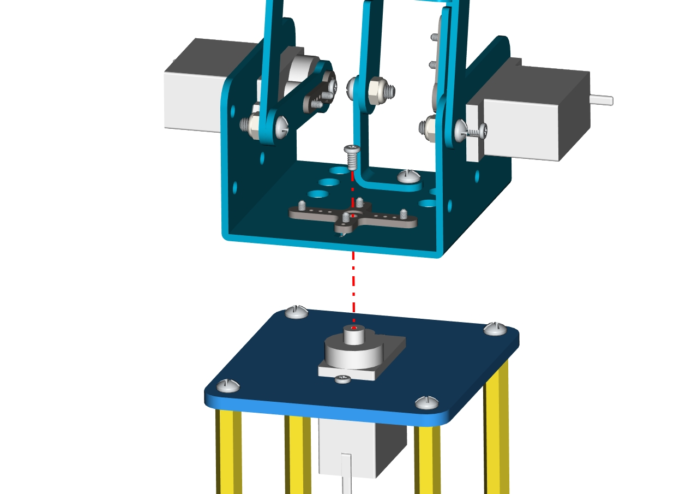

# **Keyestudio 4DOF Robot Arm Arduino Learning Kit**


# Read me frist

 **Download the APP, Code and library from the link: <https://fs.keyestudio.com/KS0488-X>**

# 1. Introduction

On the Internet, we often see DIY robotic arm complete various actions. Do you want to have one? I believe that you’ll make your own robotic arm by learning our projects.

This kit includes Arduino single-chip microcomputer, 2 joystick modules and 4 servos and so on. Next, we’ll teach you how to install and debug the robotic arm.

There are three methods to control it as follows:First, we can a wired home-made joystick controller (included in the kit); secondly, the App control is adapted; thirdly, we also can use a wireless PS2 joystick(not included in kit) .

The detailed codes and projects are provided for you. Come and let’s get started with this kit.

Note: You must connect a DC 7-15V power to VIN port of shield when wiring servo to shield.


# 2. Features

-   Detailed installation method

-   Detailed debugging methods, even you’re a beginner

-   3 control methods: wired joystick control, Bluetooth control, wireless PS2 joystick control.

-   Relevant information provided

# 3. Specification

- Keyestudio servo motor driver shield:

- VIN voltage: VIN = DC 7-15V  

- VIN current: 5A  

- Size: 73 * 53.34mm  

- 2-channel 5V Output: 5V / 3A  

- PS2 interface: Compatible with Sony PS2 receiver, can be plugged directly into the shield.


# 4. Component List

|  No  |                      Product Name                       |  QTY  |                           Picture                            |
| :--: | :-----------------------------------------------------: | :---: | :----------------------------------------------------------: |
|  1   |              Keyestudio V4.0 Control Board              |   1   |  |
|  2   |                        USB Cable                        |   1   |  |
|  3   | Keyestudio servo motor driver shield with PS2 Interface |   1   |  |
|  4   |               Keyestudio Joystick Module                |   2   |  |
|  5   |                  180°MG90S (14g) Servo                  |   1   |  |
|  6   |                      BT-24 Module                       |   1   |  |
|  7   |                       Robotic Arm                       |   1   |  |
|  8   |                MEARM 3pcs Acrylic Boards                | 1 Set |  |
|  9   |           Galvanized M2+M3  Double end Wrench           |   1   |  |
|  10  |                M3*6MM Round Head Screws                 |  36   |  |
|  11  |               M3*10MM Round Head Screws                 |   3   |  |
|  12  |                M2*8MM Round Head Screws                 |   3   |  |
|  13  |       M3*10MM Dual-pass Hexagonal Copper Pillar         |  14   |  |
|  14  |       M3*45MM Dual-pass Hexagonal Copper Pillar         |   4   |  |
|  15  |        M2 Hex Nickel Plated Stainless Steel Nut         |   3   |  |
|  16  |        M3 Hex Nickel Plated Stainless Steel Nut         |   3   |  |
|  17  |                3*100MM Black Cable Ties                 |  10   |  |
|  18  |       Male to Female 10CM/40P/2.54 24 Dupont Wire       |  25   |  |
|  19  |       Female to Female 50CM/40P/2.54 Dupont Wire        |   5   |  |
|  20  |         3*40MM Black-yellow Cross Screwdriver           |   1   |           |
|  21  |         18650 Battery Holder with 15CM Dew Line         |   1   |  |
|  22  |                    12CM Winding Pipe                    |   1   |  |

# 5. Robot Arm Projects

## Project 1: Getting Started with ARDUINO

**Keyestudio V4.0 Development Board**

You need to know that keyestudio V4.0 development board is the core of this smart turtle robot .


Keyestudio V4.0 development board is an Arduino uno -compatible board, which is based on ATmega328P MCU, and with a cp2102 Chip as a UART-to-USB converter.


It has 14 digital input/output pins (of which 6 can be used as PWM outputs), 6 analog inputs, a 16 MHz quartz crystal, a USB connection, a power jack, 2 ICSP headers and a reset button.


It contains everything needed to support the microcontroller; simply connect it to a computer with a USB cable or power it via an external DC power jack (DC 7-12V) or via female headers Vin/ GND(DC 7-12V) to get started.

| Microcontroller             | ATmega328P-PU                                            |
|-----------------------------|----------------------------------------------------------|
| Operating Voltage           | 5V                                                       |
| Input Voltage (recommended) | DC7-12V                                                  |
| Digital I/O Pins            | 14 (D0-D13)  (of which 6 provide PWM output)             |
| PWM Digital I/O Pins        | 6 (D3, D5, D6, D9, D10, D11)                             |
| Analog Input Pins           | 6 (A0-A5)                                                |
| DC Current per I/O Pin      | 20 mA                                                    |
| DC Current for 3.3V Pin     | 50 mA                                                    |
| Flash Memory                | 32 KB (ATmega328P-PU) of which 0.5 KB used by bootloader |
| SRAM                        | 2 KB (ATmega328P-PU)                                     |
| EEPROM                      | 1 KB (ATmega328P-PU)                                     |
| Clock Speed                 | 16 MHz                                                   |
| LED_BUILTIN                 | D13                                                      |

**Installing Arduino IDE**


**Click the link to start learning how to download software, install drivers, upload code, and install library files.**

**[https://getting-started-with-arduino.readthedocs.io](https://getting-started-with-arduino.readthedocs.io/en/latest/Arduino%20IDE%20Tutorial.html)**

## Project 2: Joint Rotation and Pin Control

Joint Rotation and Servo Angle Settings

|       **Name**       |                    **0°**                     |          **180°**          |
| :------------------: | :-------------------------------------------: | :------------------------: |
| Servo1（base plate） |          Rotate toward the rightmost          | Rotate toward the leftmost |
| Servo2（left side）  | Rocker arm connected to Servo 2 stretches out |         draw back          |
| Servo3（right side） |  Rocker arm connected to Servo 3 draws back   |        stretch out         |
| Servo4（clamp claw） |                     close                     |            open            |

Pin Control

|        **Name**        | **IO Pin** |
| :--------------------: | :--------: |
|  Servo 1 (base plate)  |     A1     |
|  Servo 2 (left side)   |     A0     |
|  Servo 3 (right side)  |     8      |
|  Servo 4 (clamp claw)  |     9      |
|    Right Joystick X    |     A2     |
|    Right Joystick Y    |     A5     |
| Right Joystick Z (key) |     7      |
|    Left Joystick X     |     A3     |
|    Left Joystick Y     |     A4     |
|    Left Joystick Z     |     6      |
|     D1/DAT of PS2      |     12     |
|     D0/CMD of PS2      |     11     |
|     CE/SEL of PS2      |     10     |
|       CLK of PS2       |     13     |

## Project 3: Joystick Controlling Robot Arm

Servo Control

**How to adjust the Servo Angel**

**Description**

Here we control the angle of a single servo with servo library file.

The test result is same. Before using it, we need to put the servo folder in the folder where the Arduino IDE is installed, and then open the Arduino IDE, the library file will take effect.

**Connection Diagram**


**Test Code**

```
#include <Servo.h>

Servo myservo; // create servo object to control a servo

void setup()

{

Serial.begin(9600);

delay(1000);

}

void loop()

{

myservo.attach(A0); // modify each pin to adjust

myservo.write(0); // angle value

delay(1000);

}

```

**Test Result**

Stack the driver shield on the Arduino board, upload the code, and wire according to connection diagram. After powering on, press the reset button, the servo will automatically rotate to 0°.

Rotating Automatically

**Description**

In the previous lesson, we set the angle for a single servo. In fact, we only need to continuously change the angles of the 4 servos to enable the 4 DOF robotic arm to perform different movements.

**Connection Diagram**


**Test Code**

```
#include <Servo.h>  //add Servo library file
Servo myservo1;  // create servo object to control a servo
Servo myservo2;
Servo myservo3;
Servo myservo4;  

int pos1=90, pos2=60, pos3=130, pos4=0;  // define the variable of 4 servo angle,and assign the initial value (that is the boot posture angle value) 


const int right_X = A2; // define the right X pin to A2
const int right_Y = A5; //define the right Y pin to A5
const int right_key = 7; // define the right key to 7(the value of Z axis)
const int left_X = A3; // define the left X pin to A3
const int left_Y = A4;  // define the left Y pin to A4
const int left_key = 6; // define the left key to 6(the value of Z axis)

int x1,y1,z1;  //define a variable to store the read Joystick value
int x2,y2,z2;

void setup() 
{
  //Serial.begin(9600); //  set the baud rate to 9600 

  //start up posture 
  myservo1.write(pos1);  
  delay(1000);
  myservo2.write(pos2);
  myservo3.write(pos3);
  myservo4.write(pos4);
  delay(1500);

  pinMode(right_key, INPUT);   // set the right/left key to INPUT
  pinMode(left_key, INPUT);
  //Serial.begin(9600); //  set baud rate to 9600
}
 
void loop() 
{
  myservo1.attach(A1);  //set the control pin of Servo1 to A1
  myservo2.attach(A0);  //set the control pin of Servo2 to A0
  myservo3.attach(8);   //set the control pin of Servo3 to D8
  myservo4.attach(9);   //set the control pin of Servo4 to D9

  x1 = analogRead(right_X); // read the value of right X axis

  y1 = analogRead(right_Y);  // read the value of right Y axis
  z1 = digitalRead(right_key);  ////read the value of right Z axis
  
  x2 = analogRead(left_X);  //read the value of left X axis
  y2 = analogRead(left_Y);  //read the value of left Y axis
  z2 = digitalRead(left_key);  //read the value of left Z axis
  //delay(5);  //lower the speed overall
    //Serial.println("**********right**********");
  //Serial.print("right_X = "); // on the serial monitor, print out right_X = 
  //Serial.print(x1 ,DEC); // print out the value of right X and line wrap
  //Serial.print("  ");
  //Serial.print("right_Y = ");
  //Serial.print(y1 ,DEC);
  //Serial.print("  ");
  //Serial.print("right_key = ");
  //Serial.print(z1 ,DEC);
  //Serial.print(" ||| ");
  //Serial.println("*********left***********");
  //Serial.print("left_X = ");
  //Serial.print(x2 ,DEC);
  //Serial.print("  ");
  //Serial.print("left_Y = ");
  //Serial.print(y2 ,DEC);
  //Serial.print("  ");
  //Serial.print("left_key = ");
  //Serial.println(z2 ,DEC);

  //clamp claw
  zhuazi();
  //rotate
  zhuandong();
  //Right Servo
  right_ser();
  //Left Servo
  left_ser();
}

//Claw
void zhuazi()
{
    //Claw
  if(x2<50) //if push the left joystick to the right
  {
      pos4=pos4-1;  //current angle of servo 4 subtracts 1（change the value you subtract, thus change the closed speed of claw）
      //Serial.println(pos4);
      myservo4.write(pos4);  //Servo4 operates the action，claw gradually closes
      delay(5);
      if(pos4<0)  //if pos4 value subtracts to 0
      {            //（change value according to real situation）
        pos4=0;   //stop subtraction when reduce to 0
      }
   }
  if(x2>1000) ////if push the left joystick to the left 
  {
      pos4=pos4+2; // current angle of servo 4 plus 2（change the value you plus, thus change the open speed of claw）

      //Serial.println(pos4);
      myservo4.write(pos4); //Servo4 operates the motion, the claw gradually opens.

      delay(5);
      if(pos4>110)  //limit the largest angle when open the claw 
      {
        pos4=110;                                
      }
  }
}
//******************************************************
 //rotate
void zhuandong()
{
  if(x1<50)  // if push the right joystick to the right
  {
    pos1=pos1-1;  //pos1 subtracts 1
    myservo1.write(pos1);  //Servo1 operates the motion, the arm turns right.
    delay(5);
    if(pos1<1)   //limit the angle when turn right
    {
      pos1=1;
    }
  }
  if(x1>1000)  // if push the right joystick to the left
  {
    pos1=pos1+1;  //pos1 plus 1
    myservo1.write(pos1);  //arm turns left 
    delay(5);
    if(pos1>180)  //limit the angle when turn left 
    {
      pos1=180;
    }
  }
}

//**********************************************************/
//Right Servo
void right_ser()
{
    if(y1<50) //if push the right joystick backward
  {
    pos3=pos3-1;
    myservo3.write(pos3); //the joystick of right Servo swings backward
    delay(5);
    if(pos3<0)  //limit the angle
    {
      pos3=0;
    }
  }
  if(y1>1000)  // if push the right joystick forward
  {
    pos3=pos3+1;  
    myservo3.write(pos3);  //the joystick of right Servo swings forward
    delay(5);
    if(pos3>180)  //limit the angle when go down
    {
      pos3=180;
    }
  }
}

//*************************************************************/
//Left Servo
void left_ser()
{
  if(y2<50)  //if push the left joystick backward 
  {
    pos2=pos2+1;
    myservo2.write(pos2);  //the joystick of left Servo swings backward
    delay(5);
    if(pos2>180)   // limit the retracted angle 
    {
      pos2=180;
    }
  }
  
  if(y2>1000)  //if push the left joystick forward 
  {
    pos2=pos2-1;
    myservo2.write(pos2);  //the joystick of left Servo swings forward
    delay(5);
    if(pos2<35)  // Limit the the stretched angle
    {
      pos2=35;
    }
  }

}   
```

**Test Result**

Stack the driver shield on the Arduino board, upload the code, and wire according to connection diagram. 

After powering on, press the reset button, the DOF robot arm realizes a cyclical movement: 

turn to the right, the paw releases, arm is stretched out, lower down and the paw closes, then the robot arm is retracted and raised; turn to the left, the robot arm is stretched out, lower down, claw releases, robotic arm is retracted and raised, claw closes, and then return to the right to continue to repeat the motion.

Read the JoyStick Value

**Description**

The sensor’s pin X, Y are for analog sensor, so directly read the measured analog value. 

Pin Z is a digital button, first should set the pin to Input status and then read the measured value 1 (pressed down) or 0 (not press). Check out the value printed on the serial monitor.

**Connection Diagram**


**Test Code**

```c
  const int right_X = A2; // define the right X pin to A2

  const int right_Y = A5; // define the right Y pin to A5

  const int right_key = 7; //define the right key pin to 7（that is the value Z）

  const int left_X = A3; //define the left X pin to A3

  const int left_Y = A4; // define the left Y pin to A4

  const int left_key = 6; //define the left key pin to 8（that is the value Z）

  void setup()

  {

  pinMode(right_key, INPUT); // set the right/left key to INPUT

  pinMode(left_key, INPUT);

  Serial.begin(9600); // set the baud rate to 9600

  }

  void loop()

  {

  int x1,y1,z1; // define the variable, used to save the joystick value it reads

  int x2,y2,z2;

  x1 = analogRead(right_X); // read the value of right X

  y1 = analogRead(right_Y); // read the value of right Y

  z1 = digitalRead(right_key); //// read the value of right Z

  x2 = analogRead(left_X); // read the value of left X

  y2 = analogRead(left_Y); // read the value of left Y

  z2 = digitalRead(left_key); // read the value of left Z

  //Serial.println("\*\*\*\*\*\*\*\*\*\*right\*\*\*\*\*\*\*\*\*\*");

  Serial.print("right_X = "); // on the serial monitor, print out right_X =

  Serial.print(x1 ,DEC); // print out the value of right X and line wrap

  Serial.print(" ");

  Serial.print("right_Y = ");

  Serial.print(y1 ,DEC);

  Serial.print(" ");

  Serial.print("right_key = ");

  Serial.print(z1 ,DEC);

  Serial.print(" \|\|\| ");

  //Serial.println("\*\*\*\*\*\*\*\*\*left\*\*\*\*\*\*\*\*\*\*\*");

  Serial.print("left_X = ");

  Serial.print(x2 ,DEC);

  Serial.print(" ");

  Serial.print("left_Y = ");

  Serial.print(y2 ,DEC);

  Serial.print(" ");

  Serial.print("left_key = ");

  Serial.println(z2 ,DEC);

  delay(200);

  }
  ```

**Test Result:**

Hook it up and upload well the code. Connect the Arduino control board to computer using a USB cable, then open the serial monitor and set the baud rate to 9600, you will see the analog value of the right Joystick pin X,Y, digital signal 1 or 0 of pin Z.

As shown below:


## Project 4: Assembly Guide

Adjusting angle of Servo

|        **Item**         | **Angle** |
| :---------------------: | :-------: |
| Servo1（Servo on base） |    90°    |
|  Servo2（Left Servo）   |    60°    |
|  Servo3（Right Servo）  |   130°    |
| Servo4（Servo of claw） |    0°     |

Step1: Assemble the base

1.  Firstly, you should prepare the components as follows:

-   4pcs M3*10MM dual-pass hex copper posts

-   4pcs M3*6MM round head screws

-   An Acrylic board

（Note the orientation of this acrylic board）


 Accessory 1

Assemble screws and copper posts on this acrylic board.

1.  Components needed as below:

-   2pcs M3*10MM flat head screws

-   2pcs M3 hex nuts

-   Accessory 1

-   A battery holder

Install the batter holder to the accessory 1then we get the accessory 2.


Accessory 2

1.  Components needed as below:

-   4pcs M3 * 6MM round head cross screws

-   4pcs M3 * 45MM dual-pass hex copper posts

-   Accessory 2

Mount copper posts on the accessory 2 with screws to form the accessory 3.


Accessory 3

2.  Components needed as below:

-   2 pcs M2 * 8MM round head screws

-   2 pcs M2 nuts

-   1 pcs 180°servo

-   1 Acrylic board

First set the servo to 90 °, set the servo’s angle to 90 °, stack the servo
motor driver shield onto the Arduino control board,and connect the servo to the
motor driver shield.


Upload the test code to the servo motor driver shield to make the 180°servo rotate 90°via Arduino software. When setting the servo angle, connect the servo to the A0 end of the shield(there is a silk screen on the back of the shield), upload the corresponding code, plug in power and press the reset button. Then the servo can be removed when turning to 90°。

Set the servo to **90°**

```c
int servopin=A0;//Define digital interface A0 to connect servo steering gear
signal line

int myangle; //Define angle variables

int pulsewidth; //Define pulse width variables

void setup()

{

pinMode(servopin,OUTPUT); //Set steering gear interface as Output

}

void servopulse(int servopin,int myangle) //Define Function

{

pulsewidth=(myangle*11)+500; //Converts the Angle to a pulse width value of 500

digitalWrite(servopin,HIGH); //The steering gear interface level is high

delayMicroseconds(pulsewidth); //The microsecond number of the delay pulse width value

digitalWrite(servopin,LOW); //Turn the steering gear interface level to low

delay(20-pulsewidth/1000);

}

void loop()

{

servopulse(servopin,90); //Set steering gear Angle

}

//0 Degree Code:

// servopulse(servopin,0);

//90 Degree Code:

// servopulse(servopin,90);

//180 Degree Code:

// servopulse(servopin,180);
```


Remove the servo, then install it on the acrylic board with 2 pcs M2\*8MM round head screws and 2 pcs M2 nuts. Finally, we get the accessory 4.


Accessory 4

Assemble the accessory 4 onto the accessory 3 with 4pcs M3 * 6MM round head screws to form the accessory 5


Accessory 5

Step 2: Assemble the front part of the robot arm

accessory 19

Fix the accessory 5 and the accessory 19 together with 1 pcs M2 * 5 screw. Then we get the accessory 20.



Accessory 20

Next, we need to use 8pcs M3*6MM round-head screws and 4pcs M3*10MM dual-pass hex coppers pillars to install the Arduino control board onto the accessory 20 and stack the servo motor driver shield onto the control board. Then we get the accessory 21.


At last, the front part of the robot arm is installed successfully.

Accessory 21

Then we interface the servo with the corresponding ports of servo motor driver shield. The wiring method is shown below, and the accessory 22 is generated.


The brown wire of the servo1 (Base Servo) is connected to G, the red wire is connected to V, and the orange one is connected to S (A1)


The brown wire of the servo1 (Base Servo) is connected to G, the red wire is connected to V, and the orange one is connected to S (A1)


The brown wire of the servo 2(left) is interfaced to G，the red wire to V and the orange one to S（A0）


The brown wire of the servo 2(left) is interfaced to G，the red wire to V and the orange one to S（A0）


The brown wire of the Servo 3(right)）is interfaced with G，the red wire with V and the orange one with S(8).


The brown wire of the Servo 3(right)）is interfaced with G，the red wire with V and the orange one with S(8).


Interface the brown wire of servo 4 with G, the red one with V and the orange one to S (9) with three M-F Dupont wires


Interface the brown wire of servo 4 with G, the red one with V and the orange one to S (9) with three M-F Dupont wires


Accessory 22

Step 3: Install the control part of the robotic arm

Prepare the following components as below:

-   6pcs M3 * 10MM double-pass hexagonal copper posts,

-   10pcs M3 * 6MM round head cross screws

-   2pcs joystick modules

-   A blue acrylic board

Fix the above components together to generate the accessory 23.


Accessory 23

Connect the accessory 22 and the accessory 23 together with a f-f DuPont wire, according to the following connection diagram.


On the driver shield, pin G and V of joystick modules are separately connected to G,V；

Pin X (X axis), Y (Y axis) and B(Z axis) of the right joystick module are separately connected to S（A2), S (A5) and S (7).

Pin X, Y and B of the left joystick module are separately connected to S (A3), S (A4) and S (6).


On the driver shield, pin G and V of joystick modules are separately connected to G,V；

Pin X (X axis), Y (Y axis) and B(Z axis) of the right joystick module are separately connected to S（A2), S (A5) and S (7).

Pin X, Y and B of the left joystick module are separately connected to S (A3), S (A4) and S (6).


Note: Refer to the following figure:


## Project 5: Dual-Joystick Controlling

**Description:**

In the previous section, we have introduced how to use 4 Servos to control the robot arm. Next, combine those two experiments. Use two Joystick modules to control 4DOF robot arm realize different motions.

At first, set the boot posture. The Joystick control is shown as below table.

| **Right Joystick** | **Servo**                                                    | **Left Joystick** | **Servo**                                                    |
| :----------------: | :----------------------------------------------------------- | ----------------- | ------------------------------------------------------------ |
|       X1<50       | Servo 1 gradually reduces to 0° (push the right joystick to the right, the servo that controls the arm rotation turns right, and stops at 0° ) | X2<50            | Servo 4 gradually reduces to 0° (push the left joystick to the right, the claw is closes) |
|      X1>1000      | Servo 1 gradually increases to 180° (push the right joystick to the left, the servo that controls the arm rotation turns left, and stops at 180° ) | X2>1000          | Servo 4 gradually increases to 110° (push the left joystick to the left, the claw opens) |
|      Y1>1000      | Servo 3 gradually increases to 180° ( that is, right joystick stretches out, the upper arm stretches out) | Y2>1000          | Servo2 gradually reduces to 35° ( that is, left joystick stretches out and the lower arm lifts up) |
|       Y1<50       | Servo 2 gradually reduces to 0° ( that is,the right joystick draws back, the upper arm draws back) | Y2<50            | Servo 2 gradually increases to 180° ( that is, left joystick draws back ,the lower arm decrease) |

**Connection Diagram**


**Test Code**

```c
#include <Servo.h> //add Servo library file

Servo myservo1; // create servo object to control a servo

Servo myservo2;

Servo myservo3;

Servo myservo4;

int pos1=90, pos2=60, pos3=130, pos4=0; // define the variable of 4 servo angle,and assign the initial value (that is the boot posture angle value)

const int right_X = A2; // define the right X pin to A2

const int right_Y = A5; //define the right Y pin to A5

const int right_key = 7; // define the right key to 7(the value of Z axis)

const int left_X = A3; // define the left X pin to A3

const int left_Y = A4; // define the left Y pin to A4

const int left_key = 6; // define the left key to 6(the value of Z axis)

int x1,y1,z1; //define a variable to store the read Joystick value

int x2,y2,z2;

void setup()

{

//Serial.begin(9600); // set the baud rate to 9600

//start up posture

myservo1.write(pos1);

delay(1000);

myservo2.write(pos2);

myservo3.write(pos3);

myservo4.write(pos4);

delay(1500);

pinMode(right_key, INPUT); // set the right/left key to INPUT

pinMode(left_key, INPUT);

//Serial.begin(9600); // set baud rate to 9600

}

void loop()

{

myservo1.attach(A1); //set the control pin of Servo1 to A1

myservo2.attach(A0); //set the control pin of Servo2 to A0

myservo3.attach(8); //set the control pin of Servo3 to D8

myservo4.attach(9); //set the control pin of Servo4 to D9

x1 = analogRead(right_X); // read the value of right X axis

y1 = analogRead(right_Y); // read the value of right Y axis

z1 = digitalRead(right_key); ////read the value of right Z axis

x2 = analogRead(left_X); //read the value of left X axis

y2 = analogRead(left_Y); //read the value of left Y axis

z2 = digitalRead(left_key); //read the value of left Z axis

//delay(5); //lower the speed overall

//Serial.println("\*\*\*\*\*\*\*\*\*\*right\*\*\*\*\*\*\*\*\*\*");

//Serial.print("right_X = "); // on the serial monitor, print out right_X =

//Serial.print(x1 ,DEC); // print out the value of right X and line wrap

//Serial.print(" ");

//Serial.print("right_Y = ");

//Serial.print(y1 ,DEC);

//Serial.print(" ");

//Serial.print("right_key = ");

//Serial.print(z1 ,DEC);

//Serial.print(" \|\|\| ");

//Serial.println("\*\*\*\*\*\*\*\*\*left\*\*\*\*\*\*\*\*\*\*\*");

//Serial.print("left_X = ");

//Serial.print(x2 ,DEC);

//Serial.print(" ");

//Serial.print("left_Y = ");

//Serial.print(y2 ,DEC);

//Serial.print(" ");

//Serial.print("left_key = ");

//Serial.println(z2 ,DEC);

//clamp claw

zhuazi();

//rotate

zhuandong();

//Right Servo

right_ser();

//Left Servo

left_ser();

}

//Claw

void zhuazi()

{

//Claw

if(x2<50) //if push the left joystick to the right

{

pos4=pos4-1; //current angle of servo 4 subtracts 1（change the value you subtract, thus change the closed speed of claw）

//Serial.println(pos4);

myservo4.write(pos4); //Servo4 operates the action，claw gradually closes

delay(5);

if(pos4<0) //if pos4 value subtracts to 0

{ //（change value according to real situation）

pos4=0; //stop subtraction when reduce to 0

}

}

if(x2>1000) ////if push the left joystick to the left

{

pos4=pos4+2; // current angle of servo 4 plus 2（change the value you plus, thus change the open speed of claw）

//Serial.println(pos4);

myservo4.write(pos4); //Servo4 operates the motion, the claw gradually opens.

delay(5);

if(pos4>110) //limit the largest angle when open the claw

{

pos4=110;

}

}

}

//\*\*\*\*\*\*\*\*\*\*\*\*\*\*\*\*\*\*\*\*\*\*\*\*\*\*\*\*\*\*\*\*\*\*\*\*\*\*\*\*\*\*\*\*\*\*\*\*\*\*\*\*\*\*

//rotate

void zhuandong()

{

if(x1<50) // if push the right joystick to the right

{

pos1=pos1-1; //pos1 subtracts 1

myservo1.write(pos1); //Servo1 operates the motion, the arm turns right.

delay(5);

if(pos1<1) //limit the angle when turn right

{

pos1=1;

}

}

if(x1>1000) // if push the right joystick to the left

{

pos1=pos1+1; //pos1 plus 1

myservo1.write(pos1); //arm turns left

delay(5);

if(pos1>180) //limit the angle when turn left

{

pos1=180;

}

}

}

//\*\*\*\*\*\*\*\*\*\*\*\*\*\*\*\*\*\*\*\*\*\*\*\*\*\*\*\*\*\*\*\*\*\*\*\*\*\*\*\*\*\*\*\*\*\*\*\*\*\*\*\*\*\*\*\*\*\*/

//Right Servo

void right_ser()

{

if(y1<50) //if push the right joystick backward

{

pos3=pos3-1;

myservo3.write(pos3); //the joystick of right Servo swings backward

delay(5);

if(pos3<0) //limit the angle

{

pos3=0;

}

}

if(y1\>1000) // if push the right joystick forward

{

pos3=pos3+1;

myservo3.write(pos3); //the joystick of right Servo swings forward

delay(5);

if(pos3>180) //limit the angle when go down

{

pos3=180;

}

}

}

//\*\*\*\*\*\*\*\*\*\*\*\*\*\*\*\*\*\*\*\*\*\*\*\*\*\*\*\*\*\*\*\*\*\*\*\*\*\*\*\*\*\*\*\*\*\*\*\*\*\*\*\*\*\*\*\*\*\*\*\*\*/

//Left Servo

void left_ser()

{

if(y2<50) //if push the left joystick backward

{

pos2=pos2+1;

myservo2.write(pos2); //the joystick of left Servo swings backward

delay(5);

if(pos2>180) // limit the retracted angle

{

pos2=180;

}

}

if(y2>1000) //if push the left joystick forward

{

pos2=pos2-1;

myservo2.write(pos2); //the joystick of left Servo swings forward

delay(5);

if(pos2<35) // Limit the the stretched angle

{

pos2=35;

}

}

}
```

**Test Result**

Upload code to the main control board, stack the shield on the main control board, and wire according to connection diagram. 

After powering on, the 4 DOF robot arm is in the initial position. Shake the two joysticks to control the 4 DOF robot arm to perform various movements.

## Project 6 Add Memory Function

-   **Memorize One Posture**

**Description**

In the previous section, use the analog value of pin X,Y of 2 Joystick modules to control the robot arm.

In the following experiment, we add a memory function for the robot arm, making it remember a posture then operate. 

Set 4 variables for saving the angle value of 4 servos, use the Joystick to control a posture. Press the key Z1 of right Joystick to save the angle value of 4 servos; press the key Z2 of left Joystick to make the servo operate a posture saved in the variable.

**Connection Diagram**


**Test Code**

```c
#include <Servo.h>  //add servo library file
Servo myservo1;  // create servo object to control a servo
Servo myservo2;
Servo myservo3;
Servo myservo4;  
int pos1=90, pos2=60, pos3=130, pos4=0;  // define the variable of 4 servo angle and assign the initial value( that is the boot posture angle value)

const int right_X = A2; //define rightX pin to A2 
const int right_Y = A5; //define rightY pin to A3 
const int right_key = 7; //define the pin of right key to 7（the value of Z）

const int left_X = A3; //define rightX pin to A3
const int left_Y = A4;  //define rightX pin to A4
const int left_key = 6; //define the pin of right key to 6（the value of Z）

int x1,y1,z1;  //define variable for storing the read value of Joystick
 int x2,y2,z2;
int s1,s2,s3,s4; //for saving the read angle value of servo
void setup() 
{
  myservo1.attach(A1);  //set control pin of Servo1 to A1
  myservo2.attach(A0);  //set control pin of Servo2 to A0
  myservo3.attach(8);   //set control pin of Servo3 to D6
  myservo4.attach(9);   //set control pin of Servo4 to D9

  //posture of boot-up
  myservo1.write(pos1);  
  delay(1000);
  myservo2.write(pos2);
  myservo3.write(pos3);
  myservo4.write(pos4);
  delay(1500);
    
  
  pinMode(right_key, INPUT);   //set left and right keys to input
  pinMode(left_key, INPUT);
  //Serial.begin(115200); // set baud rate to 115200
}

void loop() 
{
  x1 = analogRead(right_X); //read value of right X
  y1 = analogRead(right_Y);  //read value of right Y
  z1 = digitalRead(right_key);  ///read value of right Z
  
  x2 = analogRead(left_X);  //read value of left X
  y2 = analogRead(left_Y);  //read value of left Y
  z2 = digitalRead(left_key);  //read value of left Z
  //delay(5);  //reduce speed overall
  if(z1==1)  //determine if the right key of Joystick is pressed
  {
    delay(10);  //delay for eliminating shake 

    if(z1==1)    // judge again if the right key is pressed
    {
      s1=myservo1.read();  //read the current angle value of Servos
      s2=myservo2.read();
      s3=myservo3.read();
      s4=myservo4.read();
    }
  }
  if(z2==1) //determine if left key is pressed
  {
    delay(10);
    if(z2==1)
    {
        pos1=myservo1.read();  //memorize angle values of 4 servos
        pos2=myservo2.read();
        pos3=myservo3.read();
        pos4=myservo4.read();

        if(pos1<s1)  // if angle of servo 1 is smaller than variable s1 value
        {
          while(pos1<s1)  //while loops，rotate the servo to the position of the value stored in the array
          {
            myservo1.write(pos1); //Servo1 operates the motion
            pos1++;  //pos1 plus 1
            delay(5); //delay for 5ms to control Servo rotation speed          
}   
        }
        else  //if angle of servo 1 is greater than the value stored in array 1.
        {
          while(pos1>s1)     //while loop,rotate the servo to the position of the value stored in the array.
          {
            myservo1.write(pos1);  //Servo1 operates the motion
            pos1--;     //pos1 subtracts 1
            delay(5);   //delay for 5ms，controlling the rotation speed of servo

          }
        }
      //*************************************************  
      //the explanation is the same as servo 1 
        if(pos2<s2)
        {
          while(pos2<s2)
          {
            myservo2.write(pos2);
            pos2++;
            delay(5);
          }
        }
        else
        {
          while(pos2>s2)
          {
            myservo2.write(pos2);
            pos2--;
            delay(5);
          }
        }
     //*************************************************  
      //the explanation is the same as servo 1 
        if(pos3<s3)
        {
          while(pos3<s3)
          {
            myservo3.write(pos3);
            pos3++;
            delay(5);
          }
        }
        else
        {
          while(pos3>s3)
          {
            myservo3.write(pos3);
            pos3--;
            delay(5);
          }
        }
      //*************************************************  
      //the explanation is the same as servo 1 
        if(pos4<s4)
        {
          while(pos4<s4)
          {
            myservo4.write(pos4);
            pos4++;
            delay(5);
          }
        }
        else
        {
          while(pos4>s4)
          {
            myservo4.write(pos4);
            pos4--;
            delay(5);
          }
        }
        
    }
  }
  
  //claw
  zhuazi();
  //rotate
  zhuandong();
  //right Servo
  right_ser();
  //left Servo
  left_ser();
}


//claw
void zhuazi()
{
    //claw
  if(x2<50) //if push the left joystick to the right
  {
      pos4=pos4-1;  //current angle of servo 4 subtracts 2（change the value you subtract, thus change the closed speed of claw）
      //Serial.println(pos4);
      myservo4.write(pos4);  //Servo4 operates the action, claw is gradually closed
      delay(5);
      if(pos4<0)  //determine if the value of pos4 reduces to 0
      {            //（change value according to real situation) 
        pos4=0;   //don’t stop until reduce to 37
      }
   }
  if(x2>1000) ////if push left rocker to left side
  {
      pos4=pos4+2; //current angle of servo 4 plus 2（change the value you plus, thus change the open speed of claw）
      //Serial.println(pos4);
      myservo4.write(pos4); //Servo4 operates the motion, the claw gradually opens.
      delay(5);
      if(pos4>110)  //limit the largest angle when opening
      {
        pos4=110;
      }
  }
}
//******************************************************
 //rotate
void zhuandong()
{
  if(x1<50)  // if push the right joystick to the right 

  {
    pos1=pos1-1;  //pos1 subtracts 1
    myservo1.write(pos1);  //Servo1 operates the motion, the arm turns right
    delay(5);
    if(pos1<1)   //limit the angle when turning right
    {
      pos1=1;
    }
  }
  if(x1>1000)  //if push the right joystick to the left
  {
    pos1=pos1+1;  //pos1 plus 1
    myservo1.write(pos1);  //robot arm turns left
    delay(5);
    if(pos1>180)  // limit the angle when turning left 
    {
      pos1=180;
    }
  }
}

//**********************************************************/
//right Servo
void right_ser()
{
    if(y1<50) //if push the right joystick backward 
  {
    pos3=pos3-1;
    myservo3.write(pos3); //the joystick of right Servo swings back
    delay(5);
    if(pos3<0)  //limit angle
    {
      pos3=0;
    }
  }
  if(y1>1000)  //if push right joystick forward
  {
    pos3=pos3+1;  
    myservo3.write(pos3);  //the joystick of right Servo swings forward
    delay(5);
    if(pos3>180)  //limit descent angle
    {
      pos3=180;
    }
  }
}

//*************************************************************/
//left Servo
void left_ser()
{
  if(y2<50)  //if push the left joystick backward 
  {
    pos2=pos2+1;
myservo2.write(pos2);  //the joystick of left Servo swings backward
    delay(5);
if(pos2>180)   //limit  the retracted angle   
 {
      pos2=180;
    }
  }
  
  if(y2>1000)  //if push the left joystick forward
  {
    pos2=pos2-1;
    myservo2.write(pos2);  //the joystick of left Servo swings forward
    delay(5);
    if(pos2<35)  //limit angle when swinging forward
    {
      pos2=35;
    }
  }
  
}
```

**Test Result**

Wire it up, stack the shield onto Arduino, upload the code. Powered on, press the key Z1 of right Joystick to save the angle value of 4 servos control. Press the key Z2 of left Joystick to operate a servo posture saved in the variable.

-   **Memorize Several Postures**

**Description**

In the previous section, we have set the angle of 4 servos to make the robot arm remember and operate a posture. To extend the experiment, next make it remember several postures, at most 10 (you can set it in the code), then make 4DOF robot arm continually operate the posture in memory. 

That is, make robot arm memorize a group of actions, and you can set the memorizing speed in the code.

**Connection Diagram**


**Test Code**

```c
#include <Servo.h>  //add Servo libraries file
Servo myservo1;  // create servo object to control a servo
Servo myservo2;
Servo myservo3;
Servo myservo4;  
int pos1=90, pos2=60, pos3=130, pos4=0;  //define the variable of 4 servo angle and assign the initial value( that is the boot posture angle value)

const int right_X = A2; //define right X pin to A2 
const int right_Y = A5; //define right X pin to A5 
const int right_key = 7; //define right key to 7（the value of Z）

const int left_X = A3; //define right X pin to A3
const int left_Y = A4;  //define right Y pin to A4
const int left_key = 6; //define the left key to 6（the value of Z）

int x1,y1,z1;  //define variable for saving the read value of Joystick
int x2,y2,z2;
int s1,s2,s3,s4;
int jiyi1[10];  //define 4 array, separately save the angle of 4 Servo
int jiyi2[10];  //（array length is 10，namely can save angle data of 0~10 servo ）
int jiyi3[10];  //if need to save more data, just change the number 10 to be more larger number.
int jiyi4[10];
int i=0; //for looping
int j=0; //for saving the last value of “i”

void setup() 
{
  //posture of boot-up
  myservo1.write(pos1);  
  delay(1000);
  myservo2.write(pos2);
  myservo3.write(pos3);
  myservo4.write(pos4);
  delay(1500);
    
  
  pinMode(right_key, INPUT);   //set left and right keys to input
  pinMode(left_key, INPUT);
  //Serial.begin(115200); // set baud rate to 15200
}

void loop() 
{
  myservo1.attach(A1);  //set control pin of Servo1 to A1
  myservo2.attach(A0);  //set control pin of Servo2 to A0
  myservo3.attach(8);   // set control pin of Servo3 to D8
  myservo4.attach(9);   // set control pin of Servo4 to D9
  
  x1 = analogRead(right_X); //read the value of right X
  y1 = analogRead(right_Y);  //read the value of right Y
  z1 = digitalRead(right_key);  //read the value of right Z
  
  x2 = analogRead(left_X);  //read the value of right X
  y2 = analogRead(left_Y);  //read the value of right Y
  z2 = digitalRead(left_key);  //read the value of right Z
  //delay(5);  //reduce speed overall
  if(z1==1)   //determine if right key of Joystick is pressed
  {
    delay(10);   //delay for eliminating shake 
    if(z1==1)   //judge again if the right key is pressed
    {
      s1=myservo1.read();    //read the angle value of each servo  
      delay(100);
      //Serial.println(s1);
      s2=myservo2.read();
      delay(100);
      //Serial.println(s2);
      s3=myservo3.read();
      delay(100);
      //Serial.println(s3);
      s4=myservo4.read();
      delay(100);
      //Serial.println(s4);
      
      jiyi1[i]=s1;   //Save the read servo value to the array sequentially
      jiyi2[i]=s2;
      jiyi3[i]=s3;
      jiyi4[i]=s4;
      i++;     //i value plus 1
      j=i;     //assign the last value of i to j
      delay(100);
      //Serial.println(i);   //print out “i” on serial monitor
    }
  }
      
  if(z2==1) //determine if left key of Joystick is pressed
  {
    delay(10);
    if(z2==1)   //judge again if the left key is pressed 
    {
      i=0;  //assign “i”to 0 for memorizing next time
      pos1 = myservo1.read();    // memorize the angle value of 4 servo posture
      pos2 = myservo2.read();
      pos3 = myservo3.read();
      pos4 = myservo4.read();

      for(int k=0;k<j;k++)   //loop for j times, perform all actions saved.
      {
        if(pos1<jiyi1[k])    //if the current servo 1 angle is less than the value stored in array 1.
        {
          while(pos1<jiyi1[k])  //while loop, make servo turn to the position of value stored in the array.
          {
            myservo1.write(pos1);  //Servo1 performs the action
            delay(5);    //delay for 5ms to control Servo rotation speed
            pos1++;  //pos1 plus 1
            //Serial.println(pos1);
          }
        }
        else    // if the current Servo 1 angle is greater than the value stored in array 1.
        {
         while(pos1>jiyi1[k])     //while loop, make servo turn to the position of value stored in the array.
          {
            myservo1.write(pos1);   //Servo1 performs the action
            delay(5);    //delay 5ms，controlling the Servo rotating speed
            pos1--;     //pos1 subtracts 1
            //Serial.println(pos1);
          }
        }
//***************************************************************
  //the explanation is the same as the previous servo 
        if(pos2<jiyi2[k])
        {
          while(pos2<jiyi2[k])
          {
            myservo2.write(pos2);
            delay(5);
            pos2++;
            //Serial.println(pos1);
          }
        }
        else
        {
         while(pos2>jiyi2[k])
          {
            myservo2.write(pos2);
            delay(5);
            pos2--;
            //Serial.println(pos1);
          }
        }
 //***************************************************************
  //the explanation is the same as the previous servo 

        if(pos3<jiyi3[k])
        {
          while(pos3<jiyi3[k])
          {
            myservo3.write(pos3);
            delay(5);
            pos3++;
            //Serial.println(pos1);
          }
        }
        else
        {
         while(pos3>jiyi3[k])
          {
            myservo3.write(pos3);
            delay(5);
            pos3--;
            //Serial.println(pos1);
          }
        }
 //***************************************************************
  //the explanation is the same as the previous servo 

        if(pos4<jiyi4[k])
        {
          while(pos4<jiyi4[k])
          {
            myservo4.write(pos4);
            delay(5);
            pos4++;
            //Serial.println(pos1);
          }
        }
        else
        {
         while(pos4>jiyi4[k])
          {
            myservo4.write(pos4);
            delay(5);
            pos4--;
            //Serial.println(pos1);
          }
        }
      }
    }
  }
  
  //claw
  zhuazi();
  //rotate
  zhuandong();
  //right Servo
  right_ser();
  //left Servo
  left_ser();
}


//claw
void zhuazi()
{
    //claw
  if(x2<50) //if push the left joystick to the right 
  {
      pos4=pos4-1;  //angle of servo 4, subtract 1 (change the value you subtract, thus change the closed speed of claw)

      //Serial.println(pos4);
      myservo4.write(pos4);  //Servo4 operates the motion and claw is gradually closed. 
      delay(5);
      if(pos4<0)  //if pos4 value subtracts to 0, the claw in 37 degrees we have tested is closed.） 
      {            //（should change the value based on the fact）
        pos4=0;   //stop subtraction when reduce to 0
      }
   }
  if(x2>1000) ////if push the left joystick to the left
  {
      pos4=pos4+2; //current angle of servo 4 plus 2（change the value you plus, thus change the open speed of claw）

      //Serial.println(pos4);
      myservo4.write(pos4); //Servo4 operates the action, claw gradually opens.
      delay(5);
      if(pos4>110)  // limit the largest angle opened
      {
        pos4=110;
      }
  }
}
//******************************************************
 //rotate
void zhuandong()
{
  if(x1<50)  //if push the right joystick to the right 
  {
    pos1=pos1-1;  //pos1 subtracts 1
    myservo1.write(pos1);  //Servo1 operates the motion and robot arm turns right 
    delay(5);
    if(pos1<1)   //limit angle when turning right
    {
      pos1=1;
    }
  }
  if(x1>1000)  //if push the right joystick to the left 
  {
    pos1=pos1+1;  //pos1 plus 1
    myservo1.write(pos1);  //robot arm turns left
    delay(5);
if(pos1>180)  //limit the angle when turning left   
 {
      pos1=180;
    }
  }
}

//**********************************************************/
//right Servo
void right_ser()
{
    if(y1<50) //if push the right joystick backward 
  {
    pos3=pos3-1;
    myservo3.write(pos3); //the joystick of right Servo swings backward
    delay(5);
    if(pos3<0)  //limit angle
    {
      pos3=0;
    }
  }
  if(y1>1000)  //if push the right joystick forward

  {
    pos3=pos3+1;  
    myservo3.write(pos3);  //the joystick of right Servo swings forward
    delay(5);
    if(pos3>180)  //limit the descent speed
    {
      pos3=180;
    }
  }
}

//*************************************************************/
//left Servo
void left_ser()
{
  if(y2<50)  //if push left joystick backward
  {
    pos2=pos2+1;
myservo2.write(pos2);  //the joystick of left Servo swings backward
    delay(5);
    if(pos2>180)   //limit the retracted angle
    {
      pos2=180;
    }
  }
  
  if(y2>1000)  //if push the left joystick forward 
  {
    pos2=pos2-1;
myservo2.write(pos2);  //the joystick of left Servo swings forward.
    delay(5);
    if(pos2<35)  //limit the stretched angle
    {
      pos2=35;
    }
  }
  
}
```

**Test Result**

Wire it up, stack the shield onto Arduino , upload the code. 

Powered on, press the key Z1 of right Joystick to save the angle value of 4 servos. Press down the key Z1 to memorize different postures, at most 10 postures in the code. If need to memorize more postures, you can set it in the code. 

When memorizing successfully, press down the key Z2 of left Joystick to make the robot arm carry out several postures stored successively.

-   **Memorize Several Postures And Loop**

**Description**

In the previous section, we have introduced how to make 4DOF robot arm to memorize and perform a group of posture. Furthermore, let’s extend one more loop function. 

That is, when robot arm performs all the memorized actions, it will not stop, and continue to repeat those actions.

In the following experiment, press the key Z1, 4DOF robot arm will exit the looping action. Press the key Z1 again, start to memorize the posture, after that, press the key Z2 to loop the memorized actions.

**Connection Diagram**


**Test Code**

```c
#include <Servo.h>  //add the servo libraries
Servo myservo1;  // create servo object to control a servo
Servo myservo2;
Servo myservo3;
Servo myservo4;
int pos1=90, pos2=60, pos3=130, pos4=0;  //define the variable of 4 servo angle and assign the initial value( that is the boot posture angle value)

const int right_X = A2; //define the right X pin to A2 
const int right_Y = A5; //define the right Y pin to A5 
const int right_key = 7; //define the right key pin to 7（that is Z value）

const int left_X = A3; //define the left X pin to A3
const int left_Y = A4;  //define the left Y pin to A4
const int left_key = 6; //define the left key pin to 6（that is Z value）

int x1,y1,z1;  //define the variable, used to save the joystick value.
int x2,y2,z2;     
int s1,s2,s3,s4;
int jiyi1[20];  //define 4 array, separately used to save the angle of four servo.
int jiyi2[20];  //（array length is 20，namely can save angle data of 0~20 servo）
int jiyi3[20];  //if need to save more data, just change the number 20 to be more larger number.
int jiyi4[20];
int i=0;  //for loop
int j=0;  //save the last value of i

void setup() 
{
  // posture of boot-up
  myservo1.write(pos1);  //turn servo 1 to 90°
  delay(1000);
  myservo2.write(pos2);  //turn servo 2 to 90°
  myservo3.write(pos3);  //turn servo 3 to 120°
  myservo4.write(pos4);  //turn servo 4 to 35° 
  delay(1500);
  
  pinMode(right_key, INPUT);   //set the right/left key to INOUT
  pinMode(left_key, INPUT);
  //Serial.begin(115200);   //set baud rate to 115200
}

void loop() 
{
  myservo1.attach(A1);  //set the control pin of servo 1 to A1
  myservo2.attach(A0);  //set the control pin of servo 2 to A0
  myservo3.attach(8);   //set the control pin of servo 3 to D6
  myservo4.attach(9);   //set the control pin of servo 4 to D9
  
  x1 = analogRead(right_X); //read the right X value
  y1 = analogRead(right_Y);  //read the right Y value
  z1 = digitalRead(right_key);  //read the right Z value 
  
  x2 = analogRead(left_X);  //read the left X value
  y2 = analogRead(left_Y);  //read the left Y value
  z2 = digitalRead(left_key);  //read the left Z value
  //delay(8);  //delay, used to reduce the joystick value read, that is reduce the whole speed.
  if(z1==1)   //if the joystick right key is pressed
  {
    delay(10);  //delay for eliminating shake 
    if(z1==1)   //judge again if the right key is pressed
    {
      s1=myservo1.read();  // read the angle value of servo 1 and assign it to s1
      delay(100);
      //Serial.println(s1); //print out the angle value of servo 1 on the serial monitor
      s2=myservo2.read();  //read the angle value of servo 2 and assign it to s2
      delay(100);
      //Serial.println(s2);
      s3=myservo3.read();   //read the angle value of servo 3 and assign it to s3
      delay(100);
      //Serial.println(s3);
      s4=myservo4.read();   //read the angle value of servo 4 and assign it to s4 
      delay(100);
      //Serial.println(s4);
      
      
      jiyi1[i]=s1;  //Save the read servo value to the array sequentially
      jiyi2[i]=s2;
      jiyi3[i]=s3;
      jiyi4[i]=s4;
      i++;   //i plus 1
      j=i;   //assign the last value of i to j
      delay(100);  //delay 100ms
      //Serial.println(i);  //print out the value i
    }
  }
  if(z2==1) //if the left joystick key is pressed
  {
    delay(10);  //delay for eliminating shake 
    if(z2==1)   //judge again if the left key is pressed 
    {
      pos1 = myservo1.read();  //memorize the angle value of 4 servo posture
      pos2 = myservo2.read();
      pos3 = myservo3.read();
      pos4 = myservo4.read();
      
      while(z2==1)  //loop, make the arm repeat the action.
      {
        for(int k=1;k<j;k++)  //for loop, perform all the stored actions.
        {
          if(pos1<jiyi1[k])   //if the current servo 1 angle is less than the value stored in array 1.
          {
            while(pos1<jiyi1[k])  //whileloop, make servo turn to the position of value stored in the array.            
{
              myservo1.write(pos1);  //Servo1 performs the action
              delay(5);   //delay 5ms，controlling the servo rotating speed.
              pos1++;   //pos1 plus 1，gradually reach out the saved angle value
              //Serial.println(pos1);
            }
          }
          else   //if the current servo 1 angle is greater than the value stored in array 1.
          {
           while(pos1>jiyi1[k])    //while loop, make servo turn to the position of value stored in the array.
            {
              myservo1.write(pos1);  //Servo1 performs the action
              delay(5);   //delay 5ms，controlling the servo rotating speed.
              pos1--;   //pos1 subtracts 1
              //Serial.println(pos1);
            }
          }
  //***************************************************************
  //the explanation is the same as the previous servo. 
          if(pos2<jiyi2[k])
          {
            while(pos2<jiyi2[k])
            {
              myservo2.write(pos2);
              delay(5);
              pos2++;
              //Serial.println(pos1);
            }
          }
          else
          {
           while(pos2>jiyi2[k])
            {
              myservo2.write(pos2);
              delay(5);
              pos2--;
              //Serial.println(pos1);
            }
          }
   //*********************************************
   //the explanation is the same as the previous servo. 
          if(pos3<jiyi3[k])
          {
            while(pos3<jiyi3[k])
            {
              myservo3.write(pos3);
              delay(5);
              pos3++;
              //Serial.println(pos1);
            }
          }
          else
          {
           while(pos3>jiyi3[k])
            {
              myservo3.write(pos3);
              delay(5);
              pos3--;
              //Serial.println(pos1);
            }
          }
//*********************************************
//the explanation is the same as the previous servo. 
          if(pos4<jiyi4[k])
          {
            while(pos4<jiyi4[k])
            {
              myservo4.write(pos4);
              delay(5);
              pos4++;
              //Serial.println(pos1);
            }
          }
          else
          {
           while(pos4>jiyi4[k])
            {
              myservo4.write(pos4);
              delay(5);
              pos4--;
              //Serial.println(pos1);
            }
          }
        }
//************************************************************
//for exiting the loop
            z1 = digitalRead(right_key);  //read the right Z value
            if(z1==1)  //if the right key is pressed
            {
              delay(10);  //eliminate the shake
              if(z1==1)  //if the key z1 is pressed
              {
                //pos1=jiyi1[(j-1)];  // assign the last angle value saved in array to pos
                //pos2=jiyi2[(j-1)];  //for exiting the loop, still access to joystick control.
                //pos3=jiyi3[(j-1)];  
                //pos4=jiyi4[(j-1)];
                i=0;  //assign i as 0，prepare for saving the angle value using array
                z2=0; //assign z2 as 0，for exiting the while loop
                break;  //exit the current loop
              }
            }
//********************************************************
      }
    }
  }
  
  //claw
  zhuazi();
  //rotate
  zhuandong();
  //right Servo
  right_ser();
  //left Servo
  left_ser();
}


//claw
void zhuazi()
{
    //claw
  if(x2<50) //if push the left joystick to the right
  {
      pos4=pos4-1;  //angle of servo 4, subtract 2 (change the value you subtract, thus change the closed speed of claw)
      //Serial.println(pos4);
      myservo4.write(pos4);  //servo 4 operates the motion and claw is gradually closed.
      delay(5);
      if(pos4<0)  //if pos4 value subtracts to 0, the claw closes at 0 degree 
      {            //（should change the value based on the fact）
        pos4=0;   //stop subtraction when reduce to 2
      }
   }
  if(x2>1000) ////if push the left joystick to the left
  {
      pos4=pos4+2; //current angle of servo 4 plus 2（change the value you plus, thus change the open speed of claw）
      //Serial.println(pos4);
      myservo4.write(pos4); //Servo4 operates the action, claw gradually opens.
      delay(5);
      if(pos4>110)  //limit the largest angle opened
      {
        pos4=110;
      }
  }
}
//******************************************************
 //rotate
void zhuandong()
{
  if(x1<50)  //if push the right joystick to the right 
  {
    pos1=pos1-1;  //pos1 subtracts 1
    myservo1.write(pos1);  //servo 1 performs the action, the robot arm turns right.
    delay(5);
    if(pos1<1)   //limit the right turning angle 
    {
      pos1=1;
    }
  }
  if(x1>1000)  //if push the right joystick to the left
  {
    pos1=pos1+1;  //pos1 plus 1
    myservo1.write(pos1);  //the robot arm turns left
    delay(5);
    if(pos1>180)  //limit the left turning angle 
    {
      pos1=180;
    }
  }
}

//**********************************************************/
//right Servo
void right_ser()
{
    if(y1<50) //if push the right joystick backward
  {
    pos3=pos3-1;
    myservo3.write(pos3); //the joystick of right Servo swings backward
    delay(5);
    if(pos3<0)  //limit angle
    {
      pos3=0;
    }
  }
  if(y1>1000)  //if push the right joystick forward
  {
    pos3=pos3+1;  
    myservo3.write(pos3);  //the joystick of right Servo swings forward
    delay(5);
    if(pos3>180)  //limit the declining angle 
    {
      pos3=180;
    }
  }
}

//*************************************************************/
//left Servo
void left_ser()
{
  if(y2<50)  //if push the left joystick backward
  {
    pos2=pos2+1;
    myservo2.write(pos2);  //the joystick of left Servo swings backward
    delay(5);
    if(pos2>180)   //limit the retracted angle
    {
      pos2=180;
    }
  }
  
  if(y2>1000)  //if push the left joystick forward
  {
    pos2=pos2-1;
    myservo2.write(pos2);  //the joystick of left Servo swings forward
    delay(5);
    if(pos2<35)  //limit the stretched angle
    {
      pos2=35;
    }
  }
  
}
```

**Test Result**

Wire it up, stack the shield onto Arduino, upload the code. Powered on, press the key Z1 of right Joystick to save the angle value of 4 servos. Press down the key Z1 to memorize different postures, at most 10 postures in the code. If need to memorize more postures, can set it in the code.

When memorizing successfully, press down the key Z2 of left Joystick to make the robot arm carry out several postures stored successively, looping.

Long press the key Z1, 4DOF robot arm will exit the looping action. Press the key Z1 again, start to memorize the posture, after that, press the key Z2 to loop the memorized actions.

## Project 7: Controlling Robot Arm via Bluetooth

-   **Principle of Bluetooth Control**

**Description**

Bluetooth technology is a wireless standard technology that can realize short-distance data exchange between fixed equipment, mobile equipment and personal area network (UHF radio waves in the ISM band of 2.4-2.485GHz).

In the kit, we equip with the bt-24 Bluetooth module. the Bluetooth module support Android and IOS system.

In the experiment, we default the bt-24 Bluetooth module as the slave and the mobile phone as the master.We especially design APP to control robotic arm(Android /IOS system)


**Specification**

- Bluetooth protocol: Bluetooth Specification V5.1 BLE

- Working distance: In an open environment, achieve 40m ultra-long distance communication

- Operating frequency: 2.4GHz ISM band

- Communication interface: UART

- Bluetooth certification: in line with FCC CE ROHS REACH certification standards

- Serial port parameters: 9600, 8 data bits, 1 stop bit, invalid bit, no flow control

- Power: 5V DC

- Operating temperature: –10 to +65 degrees Celsius


Bluetooth Control Key Test

**Description**

Next, we are going to introduce the use method for BT-24 Bluetooth module. To easily use the BT-24 Bluetooth module to control the robot arm, we particularly design the APP control. Shown below.


There are 10 control keys on the App. When connect well the bt-24 Bluetooth module to Android phone using our APP, press the control key, Android phone will receive a corresponding value.

When programming, you can set the function for the corresponding value. So in the experiment, we will test each key to get the corresponding value.

Installation Steps for Android system:

**APP for Android mobile：**

Enter google play，search “keyes arm”.

<https://play.google.com/store/apps/details?id=com.keyestudio.keyes_arm_123>

**Note: Allow APP to access “location” in settings of your cellphone when connecting to Bluetooth module, otherwise, Bluetooth may not be connected.**

This are operating steps as below, the interface for Android and ios system is same.

1.  Download and install，the interface shown below:

    

2.  Upload code and power on, Led of Bluetooth module blinks. Start Bluetooth and open App to click “CONNECT” to connect.
    
    
    
3.  Upload code on control board, after power-on, LED blinks on Bluetooth module. Start Bluetooth and open App to click “connect”, Bluetooth is connected.
    
    

**For IOS system：**

1.  Open App Store

    

1.  Search “keyes arm”on APP Store，then click “downlaod”.


Special Note: Remove the Bluetooth module please, when uploading the Test Code. 

Otherwise, the program will fail to upload. After uploading the Test Code, then connect the Bluetooth and Bluetooth module to pair.

**Connection Diagram**


**Test Code**

```c
char ble_val; 
void setup() {
  Serial.begin(9600);
}
void loop() {
  if (Serial.available() > 0) 
  {
    ble_val = Serial.read();  
    Serial.println(ble_val);  
  }
}
```

After connecting Bluetooth module, open serial port monitor to set baud rate to 9600\. Press control keys on App, the serial port prints out the corresponding control character. As shown below:


**Test Result:**

The functions of control keys:

|               | Connect APP to BT-24 Bluetooth module |                                                    |
| ------------------------------------------------------------ | ------------------------------------- | -------------------------------------------------- |
|  | **Turn off Bluetooth**                |                                                    |
| :      | Press to send“F”. Release to send“S”  | Left servo goes front. Left servo stops motion     |
| :      | Press to send “L” Release to send“S”  | Clamp claw opens Clamp claw stops                  |
| :      | Mode 1                                |                                                    |
|        | Press to send “R” Release to send“S”  | Clamp claw closes Clamp claw stops                 |
|        | Press to send “B” Release to send“S”  | Left Servo draws back Left Servo stops motion      |
|        | Press to send “f” Release to send“S”  | Right servo stretches out Right servo stops motion |
|        | Press to send “l” Release to send“S”  | The base servo turns left Base servo stops         |
|        | Mode 2                                | ------------------                                 |
| :      | Press to send “r” Release to send“S”  | Base Servo turns right Base Servo stops            |
| :      | Press to send “b” Release to send“S”  | Right Servo draws back Right Servo stops           |

Bluetooth Controlling Robotic Arm

**Description** 
We introduced the control method of the 4-DOF robot arm and BT-24 Bluetooth module. In this experiment, we’ll control 4DOF robotic arm movement via APP.

Note: After uploading test code successfully, unplug the USB data cable and power up via external power supply and control 4 DOF robot arm movement via APP.

**Connection Diagram**


**Test Code**

```c
#include <Servo.h>  //add Servo library files
Servo myservo1;  // create servo object to control a servo
Servo myservo2;
Servo myservo3;
Servo myservo4;
int pos1=90, pos2=60, pos3=130, pos4=0;  // define the variables of 4 Servo angle and assign initial values(posture angle values of boot-up)
char val;


void setup()
{
   //posture of boot-up
  myservo1.write(pos1);  
  myservo2.write(pos2);
  myservo3.write(pos3);
  myservo4.write(pos4);
  delay(1500);

  Serial.begin(9600); //  set baud rate to 9600
}

void loop() 
{
  myservo1.attach(A1);  //set control pin of servo1 to A1
  myservo2.attach(A0);  //set control pin of servo2 to A0
  myservo3.attach(8);   //set control pin of servo3 to D8
  myservo4.attach(9);   //set control pin of servo4 to D9

  if(Serial.available())   //determine if data is received
  {
    val=Serial.read();    //read the received data
    Serial.println(val);
  }
  switch(val)   
    {
      case 'L':  arm_open();  break;   //claw opens
      case 'R':  arm_close();  break;   //claw closes
      case 'F':  left_f();  break;   //left servo swings forward
      case 'B':  left_b();  break;   //left servo swings back ward
      case 'f':  right_f();  break;   //right servo stretches out
      case 'b':  right_b();  break;   //right servo draws back
      case 'l':  T_left();  break;  //base servo turns left
      case 'r':  T_right();  break;  //base servo turns right
    }
}
//**************************************************
//turn left
void T_left()
{
    pos1=pos1+1;
    myservo1.write(pos1);
    delay(5);
    if(pos1>180)
    {
      pos1=180;
    }
}
//turn right
void T_right()
{
    pos1=pos1-1;
    myservo1.write(pos1);
    delay(5);
    if(pos1<1)
    {
      pos1=1;
    }
}
//********************************************
//claw closes
void arm_close()
{
      pos4=pos4-1;
      Serial.println(pos4);
      myservo4.write(pos4);
      delay(5);
      if(pos4<0)
      {
        pos4=0;
      }
}
//claw opens
void arm_open()
{
    pos4=pos4+1;
      Serial.println(pos4);
      myservo4.write(pos4);
      delay(5);
      if(pos4>108)
      {
        pos4=108;
      }
}

//******************************************
//left servo forward
void left_f()
{
    pos2=pos2-1;
    myservo2.write(pos2);
    delay(5);
    if(pos2<0)
    {
      pos2=0;
    }
}
//left servo backward
void left_b()
{
    pos2=pos2+1;
    myservo2.write(pos2);
    delay(5);
    if(pos2>180)
    {
      pos2=180;
    }
}

//***************************************
//right servo forward
void right_f()
{
  pos3=pos3+1;
    myservo3.write(pos3);
    delay(5);
    if(pos3>180)
    {
      pos3=180;
    }
}
//right servo backward
void right_b()
{
  pos3=pos3-1;
    myservo3.write(pos3);
    delay(5);
    if(pos3<35)
    {
      pos3=35;
    }
}
```

**Test Result**

Uploading Test Code，wire and power on, pair Bluetooth successfully. Control 4DOF robotic arm movement via App.

## Project 8: PS2 Controlling Robotic Arm (Extension)

PS2 Joypad Keys Test

**Description**

The shield comes with a PS2 **Joypad connector** which help you control robotic arm easily. The PS2 **Joypad**( PS2 receiver）is not included in kit. You need to purchase it online.

Firstly plug the PS2 receiver into the PS2 interface of the servo driver shield and then connect the PS2 **Joypad**. After the PS2 handle is connected well, upload code to test on Arduino IDE. Before testing, we need to put the PS2X_lib folder in the libraries folder where the Arduino IDE is installed. 

After uploading the sample code of PPS2X_lib folder, open the serial monitor, connect the PS2 **Joypad**, and press each button of the PS2 **Joypad** to view the characters printed on monitor.

**Test Code**

```c
#include <PS2X_lib.h>  //for v1.6

/******************************************************************
 * set pins connected to PS2 controller:
 *   - 1e column: original 
 *   - 2e colmun: Stef?
 * replace pin numbers by the ones you use
 ******************************************************************/


/******************************************************************
 * select modes of PS2 controller:
 *   - pressures = analog reading of push-butttons 
 *   - rumble    = motor rumbling
 * uncomment 1 of the lines for each mode selection
 ******************************************************************/
//#define pressures   true
#define pressures   false
//#define rumble      true
#define rumble      false

PS2X ps2x; // create PS2 Controller Class

//right now, the library does NOT support hot pluggable controllers, meaning 
//you must always either restart your Arduino after you connect the controller, 
//or call config_gamepad(pins) again after connecting the controller.

int error = 0;
byte type = 0;
byte vibrate = 0;

void setup(){
 
  Serial.begin(57600);
  
  delay(300);  //added delay to give wireless ps2 module some time to startup, before configuring it
   
  //CHANGES for v1.6 HERE!!! **************PAY ATTENTION*************
  
  //setup pins and settings: GamePad(clock, command, attention, data, Pressures?, Rumble?) check for error
 // error = ps2x.config_gamepad(PS2_CLK, PS2_CMD, PS2_SEL, PS2_DAT, pressures, rumble);
   error = ps2x.config_gamepad(13,11,10,12); 
  if(error == 0){
    Serial.print("Found Controller, configured successful ");
    Serial.print("pressures = ");
  if (pressures)
    Serial.println("true ");
  else
    Serial.println("false");
  Serial.print("rumble = ");
  if (rumble)
    Serial.println("true)");
  else
    Serial.println("false");
    Serial.println("Try out all the buttons, X will vibrate the controller, faster as you press harder;");
    Serial.println("holding L1 or R1 will print out the analog stick values.");
    Serial.println("Note: Go to www.billporter.info for updates and to report bugs.");
  }  
  else if(error == 1)
    Serial.println("No controller found, check wiring, see readme.txt to enable debug. visit www.billporter.info for troubleshooting tips");
   
  else if(error == 2)
    Serial.println("Controller found but not accepting commands. see readme.txt to enable debug. Visit www.billporter.info for troubleshooting tips");

  else if(error == 3)
    Serial.println("Controller refusing to enter Pressures mode, may not support it. ");
  
//  Serial.print(ps2x.Analog(1), HEX);
  
  type = ps2x.readType(); 
  switch(type) {
    case 0:
      Serial.print("Unknown Controller type found ");
      break;
    case 1:
      Serial.print("DualShock Controller found ");
      break;
    case 2:
      Serial.print("GuitarHero Controller found ");
      break;
  case 3:
      Serial.print("Wireless Sony DualShock Controller found ");
      break;
   }
}

void loop() {
  /* You must Read Gamepad to get new values and set vibration values
     ps2x.read_gamepad(small motor on/off, larger motor strenght from 0-255)
     if you don't enable the rumble, use ps2x.read_gamepad(); with no values
     You should call this at least once a second
   */  
  if(error == 1) //skip loop if no controller found
    return; 
  
  if(type == 2){ //Guitar Hero Controller
    ps2x.read_gamepad();          //read controller 
   
    if(ps2x.ButtonPressed(GREEN_FRET))
      Serial.println("Green Fret Pressed");
    if(ps2x.ButtonPressed(RED_FRET))
      Serial.println("Red Fret Pressed");
    if(ps2x.ButtonPressed(YELLOW_FRET))
      Serial.println("Yellow Fret Pressed");
    if(ps2x.ButtonPressed(BLUE_FRET))
      Serial.println("Blue Fret Pressed");
    if(ps2x.ButtonPressed(ORANGE_FRET))
      Serial.println("Orange Fret Pressed"); 

    if(ps2x.ButtonPressed(STAR_POWER))
      Serial.println("Star Power Command");
    
    if(ps2x.Button(UP_STRUM))          //will be TRUE as long as button is pressed
      Serial.println("Up Strum");
    if(ps2x.Button(DOWN_STRUM))
      Serial.println("DOWN Strum");
 
    if(ps2x.Button(PSB_START))         //will be TRUE as long as button is pressed
      Serial.println("Start is being held");
    if(ps2x.Button(PSB_SELECT))
      Serial.println("Select is being held");
    
    if(ps2x.Button(ORANGE_FRET)) {     // print stick value IF TRUE
      Serial.print("Wammy Bar Position:");
      Serial.println(ps2x.Analog(WHAMMY_BAR), DEC); 
    } 
  }
  else { //DualShock Controller
    ps2x.read_gamepad(false, vibrate); //read controller and set large motor to spin at 'vibrate' speed
    
    if(ps2x.Button(PSB_START))         //will be TRUE as long as button is pressed
      Serial.println("Start is being held");
    if(ps2x.Button(PSB_SELECT))
      Serial.println("Select is being held");      

    if(ps2x.Button(PSB_PAD_UP)) {      //will be TRUE as long as button is pressed
      Serial.print("Up held this hard: ");
      Serial.println(ps2x.Analog(PSAB_PAD_UP), DEC);
    }
    if(ps2x.Button(PSB_PAD_RIGHT)){
      Serial.print("Right held this hard: ");
      Serial.println(ps2x.Analog(PSAB_PAD_RIGHT), DEC);
    }
    if(ps2x.Button(PSB_PAD_LEFT)){
      Serial.print("LEFT held this hard: ");
      Serial.println(ps2x.Analog(PSAB_PAD_LEFT), DEC);
    }
    if(ps2x.Button(PSB_PAD_DOWN)){
      Serial.print("DOWN held this hard: ");
      Serial.println(ps2x.Analog(PSAB_PAD_DOWN), DEC);
    }   

    vibrate = ps2x.Analog(PSAB_CROSS);  //this will set the large motor vibrate speed based on how hard you press the blue (X) button
    if (ps2x.NewButtonState()) {        //will be TRUE if any button changes state (on to off, or off to on)
      if(ps2x.Button(PSB_L3))
        Serial.println("L3 pressed");
      if(ps2x.Button(PSB_R3))
        Serial.println("R3 pressed");
      if(ps2x.Button(PSB_L2))
        Serial.println("L2 pressed");
      if(ps2x.Button(PSB_R2))
        Serial.println("R2 pressed");
      if(ps2x.Button(PSB_TRIANGLE))
        Serial.println("Triangle pressed");        
    }

    if(ps2x.ButtonPressed(PSB_CIRCLE))               //will be TRUE if button was JUST pressed
      Serial.println("Circle just pressed");
    if(ps2x.NewButtonState(PSB_CROSS))               //will be TRUE if button was JUST pressed OR released
      Serial.println("X just changed");
    if(ps2x.ButtonReleased(PSB_SQUARE))              //will be TRUE if button was JUST released
      Serial.println("Square just released");     

    if(ps2x.Button(PSB_L1) || ps2x.Button(PSB_R1)) { //print stick values if either is TRUE
      Serial.print("Stick Values:");
      Serial.print(ps2x.Analog(PSS_LY), DEC); //Left stick, Y axis. Other options: LX, RY, RX  
      Serial.print(",");
      Serial.print(ps2x.Analog(PSS_LX), DEC); 
      Serial.print(",");
      Serial.print(ps2x.Analog(PSS_RY), DEC); 
      Serial.print(",");
      Serial.println(ps2x.Analog(PSS_RX), DEC); 
    }     
  }
  delay(50);  
}
```

**Test Result:**

Stack the drive shield onto Arduino and upload the code. Connecting the PS2 Joypad, open the serial monitor and set the baud rate to 57600. 

When press down the key or push the rocker, you could see the corresponding character showed on the monitor.

PS2 Joypad Control

**Description:**

In the previous section, we have showed how to use Joystick module to control the robot arm. It is almost the same for you to control the 4DOF robot arm using the PS2 Joypad.

**Connection Diagram**


**Test Code**

```c
#include <PS2X_lib.h>

PS2X ps2x; // create PS2 Controller Class


//right now, the library does NOT support hot pluggable controllers, meaning 
//you must always either restart your Arduino after you connect the controller, 
//or call config_gamepad(pins) again after connecting the controller.
int error = 0; 
byte vibrate = 0;

#include <Servo.h>  // add the servo libraries 
Servo myservo1;  // create servo object to control a servo
Servo myservo2;
Servo myservo3;
Servo myservo4;

int pos1=90, pos2=60, pos3=130, pos4=0;  // define the variable of 4 servo angle and assign the initial value( that is the boot posture angle value)

void setup(){
 Serial.begin(57600);

// boot posture
  myservo1.write(pos1);  
  delay(1000);
  myservo2.write(pos2);
  myservo3.write(pos3);
  myservo4.write(pos4);
  delay(1500);
  
 error = ps2x.config_gamepad(13,11,10,12);   //setup GamePad(clock, command, attention, data) pins, check for error
 
 if(error == 0){
   Serial.println("Found Controller, configured successful");
   Serial.println("Try out all the buttons, X will vibrate the controller, faster as you press harder;");
  Serial.println("holding L1 or R1 will print out the analog stick values.");
  Serial.println("Go to www.billporter.info for updates and to report bugs.");
 }
   
  else if(error == 1)
   Serial.println("No controller found, check wiring, see readme.txt to enable debug. visit www.billporter.info for troubleshooting tips");
   
  else if(error == 2)
   Serial.println("Controller found but not accepting commands. see readme.txt to enable debug. Visit www.billporter.info for troubleshooting tips");
   
   //Serial.print(ps2x.Analog(1), HEX);
 
 
 ps2x.enableRumble();              //enable rumble vibration motors
 ps2x.enablePressures();           //enable reading the pressure values from the buttons. 
  

  
}

void loop(){
   /* You must Read Gamepad to get new values
   Read GamePad and set vibration values
   ps2x.read_gamepad(small motor on/off, larger motor strenght from 0-255)
   if you don't enable the rumble, use ps2x.read_gamepad(); with no values
   
   you should call this at least once a second
   */

  myservo1.attach(A1);  // set the control pin of servo 1 to A1
  myservo2.attach(A0);  // set the control pin of servo 2 to A0
  myservo3.attach(8);   // set the control pin of servo 3 to D6
  myservo4.attach(9);   // set the control pin of servo 4 to D9
  
 if(error != 0)
  return; 
  
  ps2x.read_gamepad(false, vibrate);          //read controller and set large motor to spin at 'vibrate' speed
  
  if(ps2x.Button(PSB_START))                   //will be TRUE as long as button is pressed
       Serial.println("Start is being held");
  if(ps2x.Button(PSB_SELECT))
       Serial.println("Select is being held");
       
       
   if(ps2x.Button(PSB_PAD_UP)) {         //will be TRUE as long as button is pressed
     Serial.print("Up held this hard: ");
     Serial.println(ps2x.Analog(PSAB_PAD_UP), DEC);
    }
    if(ps2x.Button(PSB_PAD_RIGHT)){
     Serial.print("Right held this hard: ");
      Serial.println(ps2x.Analog(PSAB_PAD_RIGHT), DEC);
    }
    if(ps2x.Button(PSB_PAD_LEFT)){
     Serial.print("LEFT held this hard: ");
      Serial.println(ps2x.Analog(PSAB_PAD_LEFT), DEC);
    }
    if(ps2x.Button(PSB_PAD_DOWN)){
     Serial.print("DOWN held this hard: ");
   Serial.println(ps2x.Analog(PSAB_PAD_DOWN), DEC);
    }   

  
    vibrate = ps2x.Analog(PSAB_BLUE);        //this will set the large motor vibrate speed based on 
                                            //how hard you press the blue (X) button    
  
  if (ps2x.NewButtonState())               //will be TRUE if any button changes state (on to off, or off to on)
  {
      if(ps2x.Button(PSB_R3))
        
       Serial.println("R3 pressed");
     
       
      if(ps2x.Button(PSB_L3))
       Serial.println("L3 pressed");
      
      if(ps2x.Button(PSB_L2))
       Serial.println("L2 pressed");
      if(ps2x.Button(PSB_R2))
       Serial.println("R2 pressed");
      if(ps2x.Button(PSB_GREEN))
       Serial.println("Triangle pressed");
       
  }   
       
  
  if(ps2x.ButtonPressed(PSB_RED))             //will be TRUE if button was JUST pressed
       Serial.println("Circle just pressed");
       
  if(ps2x.ButtonReleased(PSB_PINK))             //will be TRUE if button was JUST released
       Serial.println("Square just released");     
  
  if(ps2x.NewButtonState(PSB_BLUE))            //will be TRUE if button was JUST pressed OR released
       Serial.println("X just changed");    

    //rotate
    zhuandong();
    //clamp claw
    zhuazi();
    //main arm
    dabi();
    //forearm
    xiaobi();
    
  if(ps2x.Button(PSB_L1) || ps2x.Button(PSB_R1)) // print stick values if either is TRUE
  {
      Serial.print("Stick Values:");
      Serial.print(ps2x.Analog(PSS_LY), DEC); //Left stick, Y axis. Other options: LX, RY, RX  
      Serial.print(",");
      Serial.print(ps2x.Analog(PSS_LX), DEC); 
      Serial.print(",");
      Serial.print(ps2x.Analog(PSS_RY), DEC); 
      Serial.print(",");
      Serial.println(ps2x.Analog(PSS_RX), DEC); 
  }    
  delay(5);    
}
//********************************************************************
// turn
void zhuandong()
{
//turn right
   if(ps2x.Analog (PSS_RX) > 200)  // if push the right joystick to the right 
    {
      //Serial.println(ps2x.Analog(PSS_RX), DEC);
      pos1=pos1-1;    //pos1 subtracts 1
      myservo1.write(pos1);   // servo 1 executes the action, the arm will turn right.
      // delay(5);
      if(pos1<1)   // limit the right turning angle 
      {
        pos1=1;
      }
     }
      // turn left
     if(ps2x.Analog (PSS_RX) < 50)    // if push the right joystick to the left
     {
       //Serial.println(ps2x.Analog(PSS_RX), DEC);
       pos1=pos1+1;   //pos1 plus 1
       myservo1.write(pos1);     // the arm turns left 
       // delay(5);
       if(pos1>180)     // limit the left turning angle
       {
         pos1=180;
       }
     }
 }
 //**********************************************************************  
 // upper arm 
void xiaobi()
{
  //upper arm front
   if(ps2x.Analog(PSS_RY)<50)  // if push the right joystick upward
   {
      pos2=pos2-1;
      myservo2.write(pos2);    // the upper arm will lift
      delay(5);
      if(pos2<0)    // limit the lifting angle
      {
        pos2=0;
      }
    }
    //upper arm back
    if(ps2x.Analog(PSS_RY)>200)    // if push the right joystick downward
    {
      pos2=pos2+1;
      myservo2.write(pos2);   // the upper arm will go down
      delay(5);
      if(pos2>180)  // limit the declining angle
      {
        pos2=180;
      }
    }
}
//***************************************************************
void zhuazi()
{
// close the claw
   if(ps2x.Analog(PSS_LX)>220)   // if push the left joystick to the right
   {
      pos4=pos4-1;
      Serial.println(pos4);
      myservo4.write(pos4);  // servo 4 carries out the action and the claw is gradually closed.
      delay(5);
      if(pos4<0)   // if pos4 value subtracts to 37, the claw in 37 degrees we have tested is closed.）
      {
        pos4=0;
      }
    }
    // open the claw
    if(ps2x.Analog(PSS_LX)<10)   // if push the left joystick to the left
    {
      pos4=pos4+8;
      Serial.println(pos4);
      myservo4.write(pos4);   // servo 4 carries out the action and the claw is gradually opened
      delay(5);
      if(pos4>108)    // limit the maximum opening angle 
      {
        pos4=108;
      }
    }
} 
//*********************************************************
void dabi()
{
  // lower arm front
  if(ps2x.Analog(PSS_LY)>200)  // if push the left joystick upward
  {
    pos3=pos3+1;
    myservo3.write(pos3);  // the lower arm will stretch out
    delay(5);
    if(pos3>180)   // limit the stretched angle
    {
      pos3=180;
    }
   }
  if(ps2x.Analog(PSS_LY)<10)    //if push the left joystick downward
  {
    pos3=pos3-1;
    myservo3.write(pos3);   // the lower arm will draw back
    delay(5);
    if(pos3<35)    // limit the retracted angle
    {
      pos3=35;
    }
   }
}
```

**Test Result:**

Stack the shield onto Arduino and upload the code. Powered on and connected the PS2 Joypad, you can use the PS2 Joypad to control the robot arm actions.

PS2 Controlling Posture Memory

**Description:**

In the previous experiment, we have showed how to use Joystick module to control the robot arm memorize several postures. Now we replace the joystick module with PS2 Joypad. The program thought is almost the same.

**Connection Diagram**


**Test Code**

```c
#include <PS2X_lib.h>
#include <Servo.h>  // add the servo libraries
Servo myservo1;  // create servo object to control a servo
Servo myservo2;
Servo myservo3;
Servo myservo4;  

int pos1=90, pos2=60, pos3=130, pos4=0;  // define the variable of 4 servo angle and assign the initial value( that is the boot posture angle value)

PS2X ps2x; // create PS2 Controller Class

//right now, the library does NOT support hot pluggable controllers, meaning 
//you must always either restart your Arduino after you conect the controller, 
//or call config_gamepad(pins) again after connecting the controller.
int error = 0; 
byte vibrate = 0;

int s1,s2,s3,s4;
int jiyi1[20];  // define four array, separately used to save the angle of 4 servos.
int jiyi2[20];
int jiyi3[20];
int jiyi4[20];
int i=0;
int j=0;

void setup()
{
 Serial.begin(57600);

 // boot posture
  myservo1.write(pos1);  
  delay(1000);
  myservo2.write(pos2);
  myservo3.write(pos3);
  myservo4.write(pos4);
  delay(1500);

  
 error = ps2x.config_gamepad(13,11,10,12);   //setup GamePad(clock, command, attention, data) pins, check for error
 
 if(error == 0){
   Serial.println("Found Controller, configured successful");
   Serial.println("Try out all the buttons, X will vibrate the controller, faster as you press harder;");
  Serial.println("holding L1 or R1 will print out the analog stick values.");
  Serial.println("Go to www.billporter.info for updates and to report bugs.");
 }
   
  else if(error == 1)
   Serial.println("No controller found, check wiring, see readme.txt to enable debug. visit www.billporter.info for troubleshooting tips");
   
  else if(error == 2)
   Serial.println("Controller found but not accepting commands. see readme.txt to enable debug. Visit www.billporter.info for troubleshooting tips");
   
   //Serial.print(ps2x.Analog(1), HEX);
 
 
 ps2x.enableRumble();              //enable rumble vibration motors
 ps2x.enablePressures();           //enable reading the pressure values from the buttons. 
  

  
}

void loop()
{
  myservo1.attach(A1);  // set the control pin of servo 1 to A1
  myservo2.attach(A0);  // set the control pin of servo 2 to A0
  myservo3.attach(8);   // set the control pin of servo 3 to D6
  myservo4.attach(9);   // set the control pin of servo 4 to D9
  
 if(error != 0)
  return; 
  
  ps2x.read_gamepad(false, vibrate);          //read controller and set large motor to spin at 'vibrate' speed
  
  if(ps2x.Button(PSB_START))                   //will be TRUE as long as button is pressed
       Serial.println("Start is being held");
  if(ps2x.Button(PSB_SELECT))
       Serial.println("Select is being held");
       
       
   if(ps2x.Button(PSB_PAD_UP)) {         //will be TRUE as long as button is pressed
     Serial.print("Up held this hard: ");
     Serial.println(ps2x.Analog(PSAB_PAD_UP), DEC);
    }
    if(ps2x.Button(PSB_PAD_RIGHT)){
     Serial.print("Right held this hard: ");
      Serial.println(ps2x.Analog(PSAB_PAD_RIGHT), DEC);
    }
    if(ps2x.Button(PSB_PAD_LEFT)){
     Serial.print("LEFT held this hard: ");
      Serial.println(ps2x.Analog(PSAB_PAD_LEFT), DEC);
    }
    if(ps2x.Button(PSB_PAD_DOWN)){
     Serial.print("DOWN held this hard: ");
   Serial.println(ps2x.Analog(PSAB_PAD_DOWN), DEC);
    }   

  
    vibrate = ps2x.Analog(PSAB_BLUE);        //this will set the large motor vibrate speed based on 
                                            //how hard you press the blue (X) button    
  
  if (ps2x.NewButtonState())               //will be TRUE if any button changes state (on to off, or off to on)
  {
      if(ps2x.Button(PSB_R3))
      {
        //Serial.println("R3 pressed");
        // record
        s1=myservo1.read();
        delay(100);
        Serial.println(s1);
        s2=myservo2.read();
        delay(100);
        Serial.println(s2);
        s3=myservo3.read();
        delay(100);
        Serial.println(s3);
        s4=myservo4.read();
        delay(100);
        Serial.println(s4);
      
        jiyi1[i]=s1;  // save the servo value read in the array sequentially
        jiyi2[i]=s2;
        jiyi3[i]=s3;
        jiyi4[i]=s4;
        i++;
        j=i;
       // delay(100);
       Serial.println(i);
      }
       
      if(ps2x.Button(PSB_L3))
      {
        //Serial.println("L3 pressed");
        i=0;
   //perform
       pos1 = myservo1.read();
       pos2 = myservo2.read();
       pos3 = myservo3.read();
       pos4 = myservo4.read();

      for(int k=0;k<j;k++)  //for loop, to execute all the stored actions
      { 
        if(pos1<jiyi1[k])  //if the current servo 1 angle is less than the value stored in array 1.
        {
          while(pos1<jiyi1[k])  //while loop, make servo turn to the position of value stored in the array.
          {
            myservo1.write(pos1);   // servo 1 executes the action
            delay(5);   // delay 5ms，controlling the rotating speed of servo
            pos1++;
            //Serial.println(pos1);
          }
        }
        else   //if the current servo 1 angle is greater than the value stored in array 1.
        {
         while(pos1>jiyi1[k])  //while loop, make servo turn to the position of value stored in the array.
          {  
            myservo1.write(pos1);   // servo 1 executes the action
            delay(5);    //delay 5ms，controlling the rotating speed of servo
            pos1--;
            //Serial.println(pos1);
          }
        
//**********************************************
// the same analysis as the previous servo
        if(pos2<jiyi2[k])
        {
          while(pos2<jiyi2[k])
          {
            myservo2.write(pos2);
            delay(5);
            pos2++;
            //Serial.println(pos1);
          }
        }
        else
        {
         while(pos2>jiyi2[k])
          {
            myservo2.write(pos2);
            delay(5);
            pos2--;
            //Serial.println(pos1);
          }
        }
 //*****************************************************
 //the same analysis 
        if(pos3<jiyi3[k])
        {
          while(pos3<jiyi3[k])
          {
            myservo3.write(pos3);
            delay(5);
            pos3++;
            //Serial.println(pos1);
          }
        }
        else
        {
         while(pos3>jiyi3[k])
          {
            myservo3.write(pos3);
            delay(5);
            pos3--;
            //Serial.println(pos1);
          }
        }
 //*****************************************************   
 //the same analysis
        if(pos4<jiyi4[k])
        {
          while(pos4<jiyi4[k])
          {
            myservo4.write(pos4);
            delay(5);
            pos4++;
            //Serial.println(pos1);
          }
        }
        else
        {
         while(pos4>jiyi4[k])
          {
            myservo4.write(pos4);
            delay(5);
            pos4--;
            //Serial.println(pos1);
          }
        }
      }
    }
      }
       
      
      if(ps2x.Button(PSB_L2))
       Serial.println("L2 pressed");
      if(ps2x.Button(PSB_R2))
       Serial.println("R2 pressed");
      if(ps2x.Button(PSB_GREEN))
       Serial.println("Triangle pressed");
       
  }   
       
  
  if(ps2x.ButtonPressed(PSB_RED))             //will be TRUE if button was JUST pressed
       Serial.println("Circle just pressed");
       
  if(ps2x.ButtonReleased(PSB_PINK))             //will be TRUE if button was JUST released
       Serial.println("Square just released");     
  
  if(ps2x.NewButtonState(PSB_BLUE))            //will be TRUE if button was JUST pressed OR released
       Serial.println("X just changed");    

    // turn
    zhuandong();
    // claw
    zhuazi();
    // lower arm
    dabi();
    // upper arm
    xiaobi();
  
  if(ps2x.Button(PSB_L1) || ps2x.Button(PSB_R1)) // print stick values if either is TRUE
  {
      Serial.print("Stick Values:");
      Serial.print(ps2x.Analog(PSS_LY), DEC); //Left stick, Y axis. Other options: LX, RY, RX  
      Serial.print(",");
      Serial.print(ps2x.Analog(PSS_LX), DEC); 
      Serial.print(",");
      Serial.print(ps2x.Analog(PSS_RY), DEC); 
      Serial.print(",");
      Serial.println(ps2x.Analog(PSS_RX), DEC); 
  } 
    
 delay(5);
}

//********************************************************************
// turn 
void zhuandong()
{
//turn right 
   if(ps2x.Analog (PSS_RX) > 200)  // if push the right joystick to the right
    {
      //Serial.println(ps2x.Analog(PSS_RX), DEC);
      pos1=pos1-1;    //pos1 subtracts 1
      myservo1.write(pos1);   // servo 1 carries out the action and the arm will turn right
      // delay(5);
      if(pos1<1)   // limit the right turning angle 
      {
        pos1=1;
      }
     }
      //turn left
     if(ps2x.Analog (PSS_RX) < 50)    //if push the right joystick to the left
     {
       //Serial.println(ps2x.Analog(PSS_RX), DEC);
       pos1=pos1+1;   //pos1 plus 1
       myservo1.write(pos1);     // the arm will turn left
       // delay(5);
       if(pos1>180)     // limit the left turning angle 
       {
         pos1=180;
       }
     }
 }
 //**********************************************************************  
 // upper arm
void xiaobi()
{
  //upper arm front
   if(ps2x.Analog(PSS_RY)<50)  // if push the right joystick upward
   {
      pos2=pos2-1;
      myservo2.write(pos2);    // the upper arm will lift up
      delay(5);
      if(pos2<0)    // limit the lifting angle 
      {
        pos2=0;
      }
    }
    // upper arm back 
    if(ps2x.Analog(PSS_RY)>200)    //if push the right joystick downward
    {
      pos2=pos2+1;
      myservo2.write(pos2);   // the upper arm will go down 
      delay(5);
      if(pos2>180)  // limit the declining angle 
      {
        pos2=180;
      }
    }
}
//***************************************************************
void zhuazi()
{
// close the claw
   if(ps2x.Analog(PSS_LX)>220)   // if push the left joystick to the right 
   {
      pos4=pos4-1;
      Serial.println(pos4);
      myservo4.write(pos4);  // servo 4 carries out the action and the claw is gradually closed.
      delay(5);
      if(pos4<0)   // if pos4 value reduces to 37（the claw we test in 37degrees is closed）
      {
        pos4=0;
      }
    }
    // open the claw
    if(ps2x.Analog(PSS_LX)<10)   // if push the left joystick to the left
    {
      pos4=pos4+8;
      Serial.println(pos4);
      myservo4.write(pos4);   // servo 4 carries out the action and the claw is gradually opened
      delay(5);
      if(pos4>108)    // limit the maximum angle opened
      {
        pos4=108;
      }
    }
} 
//*********************************************************
void dabi()
{
  // lower arm front
  if(ps2x.Analog(PSS_LY)>200)  //  if push the left joystick upward
  {
    pos3=pos3+1;
    myservo3.write(pos3);  // the lower arm will stretch out
    delay(5);
    if(pos3>180)   // limit the stretched angle
    {
      pos3=180;
    }
   }
  if(ps2x.Analog(PSS_LY)<10)    // if push the left joystick downward
  {
    pos3=pos3-1;
    myservo3.write(pos3);   //the lower arm will retract
    delay(5);
    if(pos3<35)    // limit the retracted angle
    {
      pos3=35;
    }
   }
}
```

**Test Result:**

Stack the shield onto Arduino and upload the code. Powered on and connected the PS2 Joypad, you can use the PS2 Joypad to control the robot arm memorize several postures.

PS2 Controlling Posture Memory And Loop

**Description:**

In the previous experiment, we have showed how to use Joystick module to control the robot arm memorize several postures and loop. Now we replace the Joystick module with the PS2 Joypad. The program is almost the same.

**Connection Diagram**


**Test Code**

```c
#include <PS2X_lib.h>
#include <Servo.h>  // add the servo libraries
Servo myservo1;  // create servo object to control a servo
Servo myservo2;
Servo myservo3;
Servo myservo4;  

int pos1=90, pos2=60, pos3=130, pos4=0;  // define the variable of 4 servo angle and assign the initial value( that is the boot posture angle value)

PS2X ps2x; // create PS2 Controller Class

//right now, the library does NOT support hot pluggable controllers, meaning 
//you must always either restart your Arduino after you conect the controller, 
//or call config_gamepad(pins) again after connecting the controller.
int error = 0; 
byte vibrate = 0;

int s1,s2,s3,s4;
int jiyi1[30];   //define four array, separately used to save the angle of 4 servos.
int jiyi2[30];
int jiyi3[30];
int jiyi4[30];
int i=0;
int j=0,tt=0;
void setup()
{
 Serial.begin(57600);

 // boot posture
  myservo1.write(pos1);  
  delay(1000);
  myservo2.write(pos2);
  myservo3.write(pos3);
  myservo4.write(pos4);
  delay(1500);

  
 error = ps2x.config_gamepad(13,11,10,12);   //setup GamePad(clock, command, attention, data) pins, check for error
 
 if(error == 0){
   Serial.println("Found Controller, configured successful");
   Serial.println("Try out all the buttons, X will vibrate the controller, faster as you press harder;");
  Serial.println("holding L1 or R1 will print out the analog stick values.");
  Serial.println("Go to www.billporter.info for updates and to report bugs.");
 }
   
  else if(error == 1)
   Serial.println("No controller found, check wiring, see readme.txt to enable debug. visit www.billporter.info for troubleshooting tips");
   
  else if(error == 2)
   Serial.println("Controller found but not accepting commands. see readme.txt to enable debug. Visit www.billporter.info for troubleshooting tips");
   
   //Serial.print(ps2x.Analog(1), HEX);
 
 
 ps2x.enableRumble();              //enable rumble vibration motors
 ps2x.enablePressures();           //enable reading the pressure values from the buttons. 
}

void loop()
{
  myservo1.attach(A1);  // set the control pin of servo 1 to A1
  myservo2.attach(A0);  //set the control pin of servo 2 to A0
  myservo3.attach(8);   //set the control pin of servo 3 to D6
  myservo4.attach(9);   //set the control pin of servo 4 to D9
  
 if(error != 0)
  return; 
  
  ps2x.read_gamepad(false, vibrate);          //read controller and set large motor to spin at 'vibrate' speed
  
  if(ps2x.Button(PSB_START))                   //will be TRUE as long as button is pressed
       Serial.println("Start is being held");
  if(ps2x.Button(PSB_SELECT))
       Serial.println("Select is being held");
       
       
   if(ps2x.Button(PSB_PAD_UP)) {         //will be TRUE as long as button is pressed
     Serial.print("Up held this hard: ");
     Serial.println(ps2x.Analog(PSAB_PAD_UP), DEC);
    }
    if(ps2x.Button(PSB_PAD_RIGHT)){
     Serial.print("Right held this hard: ");
      Serial.println(ps2x.Analog(PSAB_PAD_RIGHT), DEC);
    }
    if(ps2x.Button(PSB_PAD_LEFT)){
     Serial.print("LEFT held this hard: ");
      Serial.println(ps2x.Analog(PSAB_PAD_LEFT), DEC);
    }
    if(ps2x.Button(PSB_PAD_DOWN)){
     Serial.print("DOWN held this hard: ");
   Serial.println(ps2x.Analog(PSAB_PAD_DOWN), DEC);
    }   

  
    vibrate = ps2x.Analog(PSAB_BLUE);        //this will set the large motor vibrate speed based on 
                                            //how hard you press the blue (X) button    
  
  if (ps2x.NewButtonState())               //will be TRUE if any button changes state (on to off, or off to on)
  {
      if(ps2x.Button(PSB_R3))
      {
        //Serial.println("R3 pressed");
        //record
        s1=myservo1.read();
        delay(100);
        Serial.println(s1);
        s2=myservo2.read();
        delay(100);
        Serial.println(s2);
        s3=myservo3.read();
        delay(100);
        Serial.println(s3);
        s4=myservo4.read();
        delay(100);
        Serial.println(s4);
      
        jiyi1[i]=s1;  //save the servo value read in the array sequentially
        jiyi2[i]=s2;
        jiyi3[i]=s3;
        jiyi4[i]=s4;
        i++;
        j=i;
       // delay(100);
       Serial.println(i);
      }
      
       // carry out
      if(ps2x.Button(PSB_L3))
      {
        //Serial.println("L3 pressed");
        i=0;
        tt=1;
   
       pos1 = myservo1.read();  // record the angle value of 4 servo posture
       pos2 = myservo2.read();
       pos3 = myservo3.read();
       pos4 = myservo4.read();

     while(tt==1)  // repeat the actions
     {
       for(int k=0;k<j;k++)   //for loop, to execute all the stored actions.
      {
        if(pos1<jiyi1[k])   // if the current servo 1 angle is less than the value stored in array 1. 
        {
          while(pos1<jiyi1[k])    //while loop, make servo turn to the position of value stored in the array.
          {
            myservo1.write(pos1);   //servo 1 executes the action
            delay(5);     //delay 5ms，controlling the rotating speed of servo.
            pos1++;
            //Serial.println(pos1);
          }
        }
        else     //if the current servo 1 angle is greater than the value stored in array 1.
        {
         while(pos1>jiyi1[k])     //while loop, make servo turn to the position of value stored in the array.
          {
            myservo1.write(pos1);    //servo 1 executes the action
            delay(5);           //delay 5ms，controlling the rotating speed of servo.
            pos1--;
            //Serial.println(pos1);
          }
        
//**********************************************
// the same analysis as the previous servo
        if(pos2<jiyi2[k])
        {
          while(pos2<jiyi2[k])
          {
            myservo2.write(pos2);
            delay(5);
            pos2++;
            //Serial.println(pos1);
          }
        }
        else
        {
         while(pos2>jiyi2[k])
          {
            myservo2.write(pos2);
            delay(5);
            pos2--;
            //Serial.println(pos1);
          }
        }
 //*****************************************************
// the same analysis as the previous servo
        if(pos3<jiyi3[k])
        {
          while(pos3<jiyi3[k])
          {
            myservo3.write(pos3);
            delay(5);
            pos3++;
            //Serial.println(pos1);
          }
        }
        else
        {
         while(pos3>jiyi3[k])
          {
            myservo3.write(pos3);
            delay(5);
            pos3--;
            //Serial.println(pos1);
          }
        }
 //*****************************************************   
// the same analysis as the previous servo
        if(pos4<jiyi4[k])
        {
          while(pos4<jiyi4[k])
          {
            myservo4.write(pos4);
            delay(5);
            pos4++;
            //Serial.println(pos1);
          }
        }
        else
        {
         while(pos4>jiyi4[k])
          {
            myservo4.write(pos4);
            delay(5);
            pos4--;
            //Serial.println(pos1);
          }
        }
      }
    }
    //*******************************************************
    // exit the looping
     ps2x.enableRumble();              //enable rumble vibration motors
     ps2x.enablePressures();
     ps2x.read_gamepad(false, vibrate); 
     vibrate = ps2x.Analog(PSAB_BLUE);
      if (ps2x.NewButtonState())               //will be TRUE if any button changes state (on to off, or off to on)
      {
        if(ps2x.Button(PSB_R3))
        {
          tt=0;
          i=0;
          break;
        }
      }
   //*********************************************************
   }
  }

      if(ps2x.Button(PSB_L2))
       Serial.println("L2 pressed");
      if(ps2x.Button(PSB_R2))
       Serial.println("R2 pressed");
      if(ps2x.Button(PSB_GREEN))
       Serial.println("Triangle pressed");
       
  }   
       
  
  if(ps2x.ButtonPressed(PSB_RED))             //will be TRUE if button was JUST pressed
       Serial.println("Circle just pressed");
       
  if(ps2x.ButtonReleased(PSB_PINK))             //will be TRUE if button was JUST released
       Serial.println("Square just released");     
  
  if(ps2x.NewButtonState(PSB_BLUE))            //will be TRUE if button was JUST pressed OR released
       Serial.println("X just changed");    

    //turn
    zhuandong();
    //claw
    zhuazi();
    // lower arm
    dabi();
    // upper arm
    xiaobi();
  
  if(ps2x.Button(PSB_L1) || ps2x.Button(PSB_R1)) // print stick values if either is TRUE
  {
      Serial.print("Stick Values:");
      Serial.print(ps2x.Analog(PSS_LY), DEC); //Left stick, Y axis. Other options: LX, RY, RX  
      Serial.print(",");
      Serial.print(ps2x.Analog(PSS_LX), DEC); 
      Serial.print(",");
      Serial.print(ps2x.Analog(PSS_RY), DEC); 
      Serial.print(",");
      Serial.println(ps2x.Analog(PSS_RX), DEC); 
  } 
    
 delay(5);
}

//********************************************************************
// turn 
void zhuandong()
{
// turn right
   if(ps2x.Analog (PSS_RX) > 200)  // if push the right joystick to the right
    {
      //Serial.println(ps2x.Analog(PSS_RX), DEC);
      pos1=pos1-1;    //pos1 subtracts 1
      myservo1.write(pos1);   // servo 1 carries out the action, the robot arm turns right.
      // delay(5);
      if(pos1<1)   // limit the right turning angle
      {
        pos1=1;
      }
     }
      // turn left
     if(ps2x.Analog (PSS_RX) < 50)    // if push the right joystick to the left
     {
       //Serial.println(ps2x.Analog(PSS_RX), DEC);
       pos1=pos1+1;   //pos1 plus 1
       myservo1.write(pos1);     // the robot arm turns left 
       // delay(5);
       if(pos1>180)     // limit the left turning angle
       {
         pos1=180;
       }
     }
 }
 //**********************************************************************  
 // the upper arm 
void xiaobi()
{
  // upper arm front
   if(ps2x.Analog(PSS_RY)<50)  // if push the right joystick upward
   {
      pos2=pos2-1;
      myservo2.write(pos2);    // the upper arm will lift up
      delay(5);
      if(pos2<0)    // limit the lifting angle 
      {
        pos2=0;
      }
    }
    // upper arm back
    if(ps2x.Analog(PSS_RY)>200)    //if push the right joystick to downward
    {
      pos2=pos2+1;
      myservo2.write(pos2);   // the robot arm will go down
      delay(5);
      if(pos2>180)  // limit the declining angle
      {
        pos2=180;
      }
    }
}
//***************************************************************
void zhuazi()
{
// close the claw
   if(ps2x.Analog(PSS_LX)>220)   // if push the left joystick to the right  
   {
      pos4=pos4-1;
      Serial.println(pos4);
      myservo4.write(pos4);  // servo 4 carries out the action and claw is gradually closed 
      delay(5);
      if(pos4<0)   // if pos4 value subtracts to 37, the claw in 37 degrees we have tested is closed.）
      {
        pos4=0;
      }
    }
    // open the claw
    if(ps2x.Analog(PSS_LX)<10)   //  if push the left joystick to the left
    {
      pos4=pos4+8;
      Serial.println(pos4);
      myservo4.write(pos4);   //  servo 4 carries out the action and claw is gradually opened
      delay(5);
      if(pos4>108)    // limit the maximum angle opened
      {
        pos4=108;
      }
    }
} 
//*********************************************************
void dabi()
{
  // lower arm front
  if(ps2x.Analog(PSS_LY)>200)  // if push the left joystick upward
  {
    pos3=pos3+1;
    myservo3.write(pos3);  //  the lower arm will stretch out
    delay(5);
    if(pos3>180)   // limit the stretched angle 
    {
      pos3=180;
    }
   }
  if(ps2x.Analog(PSS_LY)<10)    // if push the left joystick downward
  {
    pos3=pos3-1;
    myservo3.write(pos3);   // the lower arm will draw back 
    delay(5);
    if(pos3<35)    //  limit the retracted angle 
    {
      pos3=35;
    }
   }
}
```

**Test Result:**

Stack the shield onto Arduino and upload the code. Powered on and connected the PS2 Joypad, you can use the PS2 Joypad to control the robot arm memorize several postures, looping.


