# 1. Resource Download

 **Download the test code and library from the link: <https://fs.keyestudio.com/KS0488-X>**

# 2. Product Introduction

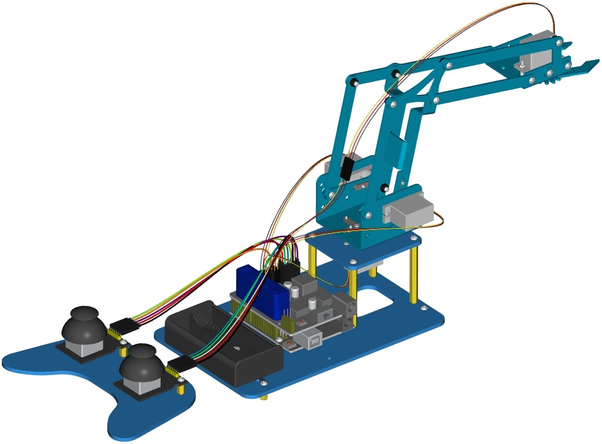

On the Internet, we often see DIY robotic arm complete various actions. Do you want to have one? I believe that you’ll make your own robotic arm by learning our projects.

This kit includes Arduino single-chip microcomputer, 2 joystick modules and 4 servos and so on. Next, we’ll teach you how to install and debug the robotic arm.

There are three methods to control it as follows:First, we can a wired home-made joystick controller (included in the kit); secondly, the App control is adapted; thirdly, we also can use a wireless PS2 joystick(not included in kit) .

The detailed codes and projects are provided for you. Come and let’s get started with this kit.

Note: You must connect a DC 7-15V power to VIN port of shield when wiring servo to shield.

# 3. Features

-   Detailed installation method

-   Detailed debugging methods, even you’re a beginner

-   3 control methods: wired joystick control, Bluetooth control, wireless PS2 joystick control.

-   Relevant information provided

# 4. Specification

- Keyestudio servo motor driver shield:

- VIN voltage: VIN = DC 7-15V  

- VIN current: 5A  

- Size: 73 * 53.34mm  

- 2-channel 5V Output: 5V / 3A  

- PS2 interface: Compatible with Sony PS2 receiver, can be plugged directly into the shield.

# 5. Component List

|  No  |                      Product Name                       |  QTY  |                           Picture                            |
| :--: | :-----------------------------------------------------: | :---: | :----------------------------------------------------------: |
|  1   |              Keyestudio V4.0 Control Board              |   1   | 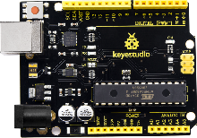 |
|  2   |                        USB Cable                        |   1   |  |
|  3   | Keyestudio servo motor driver shield with PS2 Interface |   1   | 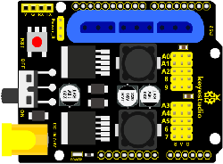 |
|  4   |               Keyestudio Joystick Module                |   2   | 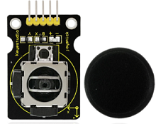 |
|  5   |                  180°MG90S (14g) Servo                  |   1   | 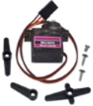 |
|  6   |                      BT-24 Module                       |   1   | 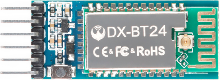 |
|  7   |                       Robotic Arm                       |   1   | 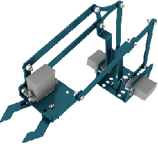 |
|  8   |                MEARM 3pcs Acrylic Boards                | 1 Set |  |
|  9   |           Galvanized M2+M3  Double end Wrench           |   1   |  |
|  10  |                M3*6MM Round Head Screws                 |  32   | 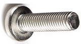 |
|  11  |               M3*10MM Round Head Screws                 |   3   |  |
|  12  |                M2*8MM Round Head Screws                 |   3   |  |
|  13  |       M3*10MM Dual-pass Hexagonal Copper Pillar         |  14   | 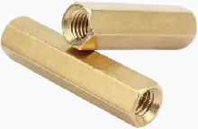 |
|  14  |       M3*45MM Dual-pass Hexagonal Copper Pillar         |   4   |  |
|  15  |        M2 Hex Nickel Plated Stainless Steel Nut         |   3   | 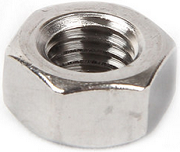 |
|  16  |        M3 Hex Nickel Plated Stainless Steel Nut         |   3   |  |
|  17  |                3*100MM Black Cable Ties                 |  10   | 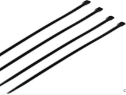 |
|  18  |       Male to Female 10CM/40P/2.54 24 Dupont Wire       |  10   | 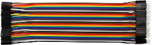 |
|  19  |       Female to Female 50CM/40P/2.54 Dupont Wire        |  25   | 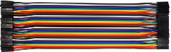 |
|  20  |         3*40MM Black-yellow Cross Screwdriver           |   1   |           |
|  21  |         18650 Battery Holder with 15CM Dew Line         |   1   |  |
|  22  |                    12CM Winding Pipe                    |   1   | 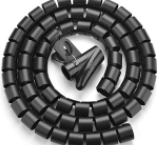 |

