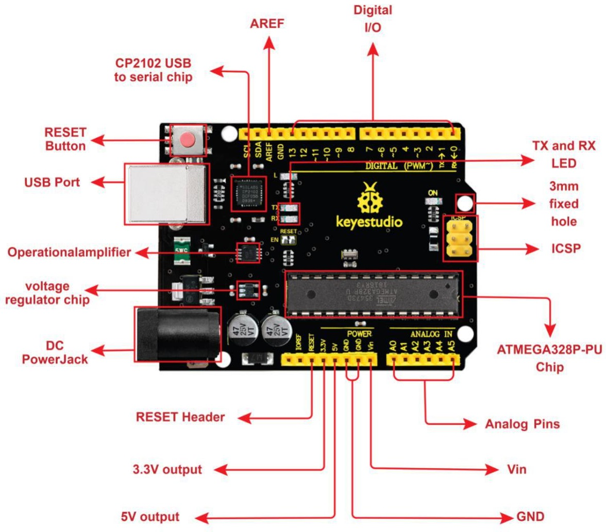

## Project 1: Getting Started with ARDUINO

**Keyestudio V4.0 Development Board**

You need to know that keyestudio V4.0 development board is the core of this smart turtle robot .

Keyestudio V4.0 development board is an Arduino uno -compatible board, which is based on ATmega328P MCU, and with a cp2102 Chip as a UART-to-USB converter.

It has 14 digital input/output pins (of which 6 can be used as PWM outputs), 6 analog inputs, a 16 MHz quartz crystal, a USB connection, a power jack, 2 ICSP headers and a reset button.

It contains everything needed to support the microcontroller; simply connect it to a computer with a USB cable or power it via an external DC power jack (DC 7-12V) or via female headers Vin/ GND(DC 7-12V) to get started.

| Microcontroller             | ATmega328P-PU                                            |
|-----------------------------|----------------------------------------------------------|
| Operating Voltage           | 5V                                                       |
| Input Voltage (recommended) | DC7-12V                                                  |
| Digital I/O Pins            | 14 (D0-D13)  (of which 6 provide PWM output)             |
| PWM Digital I/O Pins        | 6 (D3, D5, D6, D9, D10, D11)                             |
| Analog Input Pins           | 6 (A0-A5)                                                |
| DC Current per I/O Pin      | 20 mA                                                    |
| DC Current for 3.3V Pin     | 50 mA                                                    |
| Flash Memory                | 32 KB (ATmega328P-PU) of which 0.5 KB used by bootloader |
| SRAM                        | 2 KB (ATmega328P-PU)                                     |
| EEPROM                      | 1 KB (ATmega328P-PU)                                     |
| Clock Speed                 | 16 MHz                                                   |
| LED_BUILTIN                 | D13                                                      |

**Installing Arduino IDE**

**Click the link to start learning how to download Arduino IDE software, install drivers, upload code, and install library files.**

**[https://getting-started-with-arduino.readthedocs.io](https://getting-started-with-arduino.readthedocs.io/en/latest/Arduino%20IDE%20Tutorial.html)**
