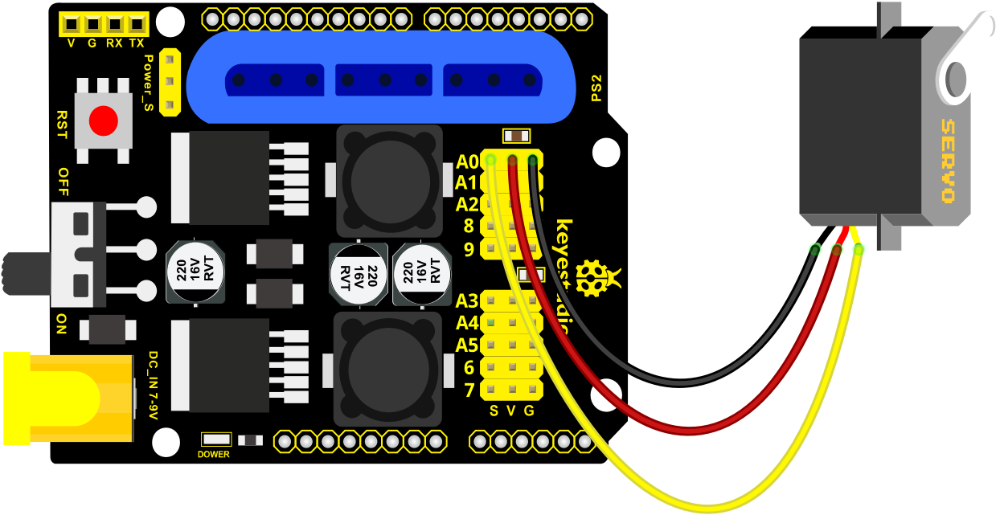

## Project 3: Joystick Controlling Robot Arm

### Project 3.1: adjust the Servo Angel

**Description**

Here we control the angle of a single servo with servo library file.

The test result is same. Before using it, we need to put the servo folder in the folder where the Arduino IDE is installed, and then open the Arduino IDE, the library file will take effect.

**Connection Diagram**



**Test Code**

```c
#include <Servo.h>
Servo myservo;  // create servo object to control a servo

void setup()
{
  Serial.begin(9600); 
  delay(1000);
}

void loop() 
{
  myservo.attach(A0);  // modify each pin to adjust 
  myservo.write(0);  // angle value  
  delay(1000);
}
```

**Test Result**

Stack the driver shield on the Arduino board, upload the code, and wire according to connection diagram. After powering on, press the reset button, the servo will automatically rotate to 0°.

### Project 3.2: Rotating Automatically

**Description**

In the previous lesson, we set the angle for a single servo. In fact, we only need to continuously change the angles of the 4 servos to enable the 4 DOF robotic arm to perform different movements.

**Connection Diagram**


**Test Code**

```c
#include <Servo.h>
Servo myservo1;  // create servo object to control a servo
Servo myservo2;
Servo myservo3;
Servo myservo4;
int pos1=90, pos2=60, pos3=130, pos4=0; 

void setup()
{
  myservo1.attach(A1);  // attaches the servo on pin 9 to the servo object
  myservo2.attach(A0);
  myservo3.attach(8);
  myservo4.attach(9);
  
  myservo1.write(pos1);
  delay(1000);
  myservo2.write(pos2);
  myservo3.write(pos3);
  myservo4.write(pos4);
  delay(1500);
}

void loop() 
{
  // turn right
  for(pos1;pos1>0;pos1--)
  {
    myservo1.write(pos1);
    delay(5);      // delay 5ms（used to adjust the servo speed）
  }
  delay(1000);
  
  // open the claw
 for(pos4;pos4<100;pos4++)
 {
   myservo4.write(pos4);
 }
  delay(1000);
  
  // right servo rotates to 100 degrees
  for(pos2;pos2<100;pos2++)
  {
    myservo2.write(pos2);
    delay(5);
  }
  // left servo rotates to 5 degrees
  for(pos3;pos3<180;pos3++)
  {
    myservo3.write(pos3);
    delay(5);
  }
  delay(1500);
  
  // close the claw 
  for(pos4;pos4>0;pos4--)
  {
    myservo4.write(pos4);
  }
  delay(1000);
  
  // left servo rotates to100 degrees, rocker arm lifts.
  for(pos3;pos3>120;pos3--)
  {
    myservo3.write(pos3);
    delay(5);
  }
  delay(1000);

  // turn to left 
  for(pos1;pos1<180;pos1++)
  {
    myservo1.write(pos1);
    delay(5);
  }
  delay(1000);

  // Lower the arm 
  for(pos3;pos3<180;pos3++)
  {
    myservo3.write(pos3);
    delay(5);
  }
  delay(1000);

  // open the claw
  for(pos4;pos4<100;pos4++)
  {
    myservo4.write(pos4);
  }
  delay(1000);

  // lift up the arm 
  for(pos3;pos3>120;pos3--)
  {
    myservo3.write(pos3);
    delay(5);
  }
  delay(1000);

  // close the claw 
  for(pos4;pos4>0;pos4--)
  {
    myservo4.write(pos4);
  }
  delay(1000);
}  
```

**Test Result**

Stack the driver shield on the Arduino board, upload the code, and wire according to connection diagram. 

After powering on, press the reset button, the DOF robot arm realizes a cyclical movement: 

turn to the right, the paw releases, arm is stretched out, lower down and the paw closes, then the robot arm is retracted and raised; turn to the left, the robot arm is stretched out, lower down, claw releases, robotic arm is retracted and raised, claw closes, and then return to the right to continue to repeat the motion.

### Project 3.3: Read the JoyStick Value

**Description**

The sensor’s pin X, Y are for analog sensor, so directly read the measured analog value. 

Pin Z is a digital button, first should set the pin to Input status and then read the measured value 1 (pressed down) or 0 (not press). Check out the value printed on the serial monitor.

**Connection Diagram**


**Test Code**

```c
const int right_X = A2; // define the right X pin to A2 
const int right_Y = A5; // define the right Y pin to A5 
const int right_key = 7; //define the right key pin to 7（that is the value Z）

const int left_X = A3; //define the left X pin to A3
const int left_Y = A4;  // define the left Y pin to A4
const int left_key = 6; //define the left key pin to 8（that is the value Z） 

void setup() 
{
  pinMode(right_key, INPUT);   // set the right/left key to INPUT 
  pinMode(left_key, INPUT);
  Serial.begin(9600); //  set the baud rate to 9600
}

void loop() 
{
  int x1,y1,z1;  // define the variable, used to save the joystick value it reads
  int x2,y2,z2;
  
  x1 = analogRead(right_X); // read the value of right X 
  y1 = analogRead(right_Y);  // read the value of right Y 
  z1 = digitalRead(right_key);  //// read the value of right Z 
  
  x2 = analogRead(left_X);  // read the value of left X
  y2 = analogRead(left_Y);  // read the value of left Y 
  z2 = digitalRead(left_key);  // read the value of left Z 

  //Serial.println("**********right**********");
  Serial.print("right_X = "); // on the serial monitor, print out right_X = 
  Serial.print(x1 ,DEC); // print out the value of right X and line wrap
  Serial.print("  ");
  Serial.print("right_Y = ");
  Serial.print(y1 ,DEC);
  Serial.print("  ");
  Serial.print("right_key = ");
  Serial.print(z1 ,DEC);
  Serial.print(" ||| ");
  //Serial.println("*********left***********");
  Serial.print("left_X = ");
  Serial.print(x2 ,DEC);
  Serial.print("  ");
  Serial.print("left_Y = ");
  Serial.print(y2 ,DEC);
  Serial.print("  ");
  Serial.print("left_key = ");
  Serial.println(z2 ,DEC);

  delay(200);
}
```

**Test Result:**

Hook it up and upload well the code. Connect the Arduino control board to computer using a USB cable, then open the serial monitor and set the baud rate to 9600, you will see the analog value of the right Joystick pin X,Y, digital signal 1 or 0 of pin Z.

As shown below:


