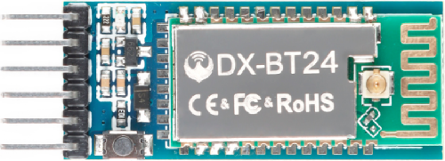
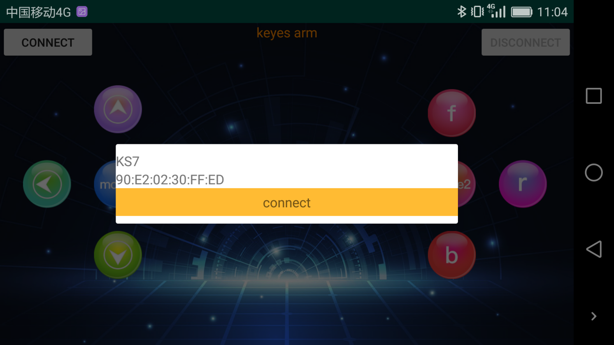
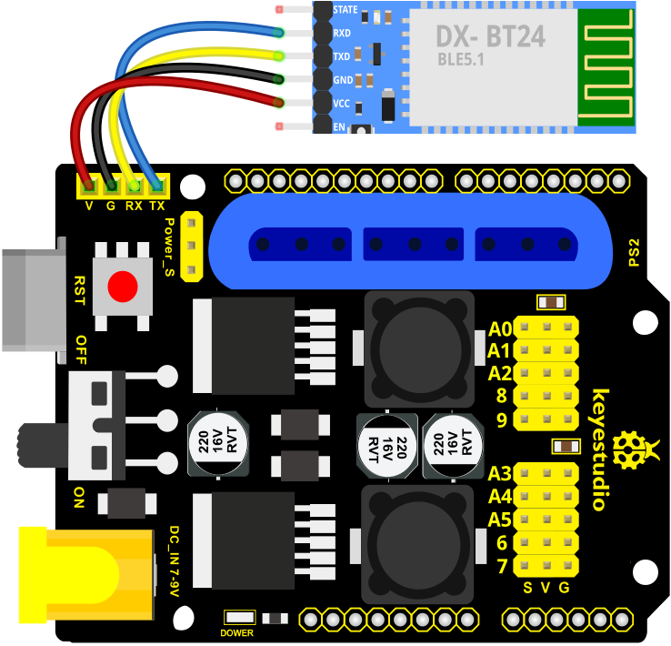

## Project 7: Controlling Robot Arm via Bluetooth

### Project 7.1: Bluetooth Control Key Test

**Description**

Bluetooth technology is a wireless standard technology that can realize short-distance data exchange between fixed equipment, mobile equipment and personal area network (UHF radio waves in the ISM band of 2.4-2.485GHz).

In the kit, we equip with the bt-24 Bluetooth module. the Bluetooth module support Android and IOS system.

In the experiment, we default the bt-24 Bluetooth module as the slave and the mobile phone as the master.We especially design APP to control robotic arm(Android /IOS system)



**Specification**

- Bluetooth protocol: Bluetooth Specification V5.1 BLE
- Working distance: In an open environment, achieve 40m ultra-long distance communication
- Operating frequency: 2.4GHz ISM band
- Communication interface: UART
- Bluetooth certification: in line with FCC CE ROHS REACH certification standards
- Serial port parameters: 9600, 8 data bits, 1 stop bit, invalid bit, no flow control
- Power: 5V DC
- Operating temperature: –10 to +65 degrees Celsius

Next, we are going to introduce the use method for BT-24 Bluetooth module. To easily use the BT-24 Bluetooth module to control the robot arm, we particularly design the APP control. Shown below.


There are 10 control keys on the App. When connect well the bt-24 Bluetooth module to Android phone using our APP, press the control key, Android phone will receive a corresponding value.

When programming, you can set the function for the corresponding value. So in the experiment, we will test each key to get the corresponding value.

**APP for Android system：**

Enter google play，search “**keyes arm**”.

<https://play.google.com/store/apps/details?id=com.keyestudio.keyes_arm_123>

**<span style="color: rgb(255, 76, 65);">Note:</span> Allow APP to access “location” in settings of your cellphone when connecting to Bluetooth module, otherwise, Bluetooth may not be connected.**

This are operating steps as below, the interface for Android and ios system is same.

1\. Download and install，the interface shown below:


2\. Upload code and power on, Led of Bluetooth module blinks. Start Bluetooth and open App to click “**CONNECT**” to connect.
    
 
    
3\. Upload code on control board, after power-on, LED blinks on Bluetooth module. Start Bluetooth and open App to click “**connect**”, Bluetooth is connected.
    


**For IOS system：**

1\. Open App Store


2\. Search “**keyes arm**” on APP Store，then click “**downlaod**”.


**Test Code**

```c
char ble_val; 
void setup() {
  Serial.begin(9600);
}
void loop() {
  if (Serial.available() > 0) 
  {
    ble_val = Serial.read();  
    Serial.println(ble_val);  
  }
}
```
**<span style="color: rgb(255, 76, 65);">Special Note:</span>** Remove the Bluetooth module please, when uploading the Test Code. 

Otherwise, the program will fail to upload. After uploading the Test Code, then connect the Bluetooth and Bluetooth module to pair.

**Connection Diagram**



**Test Result:**

After connecting Bluetooth module, wire and power on, pair Bluetooth successfully. Open serial port monitor to set baud rate to 9600\. Press control keys on App, the serial port prints out the corresponding control character. As shown below:


The functions of control keys:

|               | Connect APP to BT-24 Bluetooth module |                                                    |
| ------------------------------------------------------------ | ------------------------------------- | -------------------------------------------------- |
|  | **Turn off Bluetooth**                |                                                    |
| :      | Press to send“F”. Release to send“S”  | Left servo goes front. Left servo stops motion     |
| :      | Press to send “L” Release to send“S”  | Clamp claw opens Clamp claw stops                  |
| :      | Mode 1                                |                                                    |
|        | Press to send “R” Release to send“S”  | Clamp claw closes Clamp claw stops                 |
|        | Press to send “B” Release to send“S”  | Left Servo draws back Left Servo stops motion      |
|        | Press to send “f” Release to send“S”  | Right servo stretches out Right servo stops motion |
|        | Press to send “l” Release to send“S”  | The base servo turns left Base servo stops         |
|        | Mode 2                                | ------------------                                 |
| :      | Press to send “r” Release to send“S”  | Base Servo turns right Base Servo stops            |
| :      | Press to send “b” Release to send“S”  | Right Servo draws back Right Servo stops           |

### Project 7.2: Bluetooth Controlling Robotic Arm

**Description** 

We introduced the control method of the 4-DOF robot arm and BT-24 Bluetooth module. In this experiment, we’ll control 4DOF robotic arm movement via APP.

Note: After uploading test code successfully, unplug the USB data cable and power up via external power supply and control 4 DOF robot arm movement via APP.

**Test Code**

```c
#include <Servo.h>  //add Servo library files
Servo myservo1;  // create servo object to control a servo
Servo myservo2;
Servo myservo3;
Servo myservo4;
int pos1=90, pos2=60, pos3=130, pos4=0;  // define the variables of 4 Servo angle and assign initial values(posture angle values of boot-up)
char val;


void setup()
{
   //posture of boot-up
  myservo1.write(pos1);  
  myservo2.write(pos2);
  myservo3.write(pos3);
  myservo4.write(pos4);
  delay(1500);

  Serial.begin(9600); //  set baud rate to 9600
}

void loop() 
{
  myservo1.attach(A1);  //set control pin of servo1 to A1
  myservo2.attach(A0);  //set control pin of servo2 to A0
  myservo3.attach(8);   //set control pin of servo3 to D8
  myservo4.attach(9);   //set control pin of servo4 to D9

  if(Serial.available())   //determine if data is received
  {
    val=Serial.read();    //read the received data
    Serial.println(val);
  }
  switch(val)   
    {
      case 'L':  arm_open();  break;   //claw opens
      case 'R':  arm_close();  break;   //claw closes
      case 'F':  left_f();  break;   //left servo swings forward
      case 'B':  left_b();  break;   //left servo swings back ward
      case 'f':  right_f();  break;   //right servo stretches out
      case 'b':  right_b();  break;   //right servo draws back
      case 'l':  T_left();  break;  //base servo turns left
      case 'r':  T_right();  break;  //base servo turns right
    }
}
//**************************************************
//turn left
void T_left()
{
    pos1=pos1+1;
    myservo1.write(pos1);
    delay(5);
    if(pos1>180)
    {
      pos1=180;
    }
}
//turn right
void T_right()
{
    pos1=pos1-1;
    myservo1.write(pos1);
    delay(5);
    if(pos1<1)
    {
      pos1=1;
    }
}
//********************************************
//claw closes
void arm_close()
{
      pos4=pos4-1;
      Serial.println(pos4);
      myservo4.write(pos4);
      delay(5);
      if(pos4<0)
      {
        pos4=0;
      }
}
//claw opens
void arm_open()
{
    pos4=pos4+1;
      Serial.println(pos4);
      myservo4.write(pos4);
      delay(5);
      if(pos4>108)
      {
        pos4=108;
      }
}

//******************************************
//left servo forward
void left_f()
{
    pos2=pos2-1;
    myservo2.write(pos2);
    delay(5);
    if(pos2<0)
    {
      pos2=0;
    }
}
//left servo backward
void left_b()
{
    pos2=pos2+1;
    myservo2.write(pos2);
    delay(5);
    if(pos2>180)
    {
      pos2=180;
    }
}

//***************************************
//right servo forward
void right_f()
{
  pos3=pos3+1;
    myservo3.write(pos3);
    delay(5);
    if(pos3>180)
    {
      pos3=180;
    }
}
//right servo backward
void right_b()
{
  pos3=pos3-1;
    myservo3.write(pos3);
    delay(5);
    if(pos3<35)
    {
      pos3=35;
    }
}
```
**<span style="color: rgb(255, 76, 65);">Special Note:</span>** Remove the Bluetooth module please, when uploading the Test Code. 

Otherwise, the program will fail to upload. After uploading the Test Code, then connect the Bluetooth and Bluetooth module to pair.

**Connection Diagram**


**Test Result**

After uploading the Test Code, wire and power on, pair Bluetooth successfully. Control 4DOF robotic arm movement via App.
